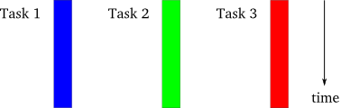

=============================
パート1: さあ、はじめましょう
=============================

はじめに
--------

すこし前のことですが、 `Twisted`_ の `メーリングリスト <http://twistedmatrix.com/cgi-bin/mailman/listinfo/twisted-python>`_ に「Twisted の入門用の文書は死の淵にあるね」という趣旨の `投稿 <http://twistedmatrix.com/pipermail/twisted-python/2009-May/019706.html>`_ がありました。まったくもってそんなことはありません。Twisted と Python での非同期プログラミングの入門用の文書に関しては、真逆にあるかもしれません。もし時間がなかったり我慢強くなければ、これはあなたが探している入門用の文書ではありません。

.. _Twisted: http://twistedmatrix.com/

あなたが非同期プログラミングの初学者ならば、手っ取り早い入門用の文書に巡り合うことはまぁ無理だろうとも信じています。少なくともあなたは天才でないでしょうし。私は何年も Twisted を使ってきて、どうやって自分が最初に (ゆっくりと) 学び、何が難しいのかを考えてくるうちに、数をこなすことが大事なのではなく、非同期コードを書いて理解するために要求される「メンタルモデル」の獲得が大事であるとの結論に達しました。Twisted のソースコードのほとんどは明快でしっかり書かれており、オンラインで読めるドキュメントも良質です。たいていのフリーソフトウェアを基準にした場合に、です。しかし、メンタルモデルがなければTwisted のコードベースや Twisted を使っているコードを読むことや、大量のドキュメントを読むことでさえ、困惑したり頭を悩ますことにしかならないでしょう。

このため、この入門の最初のパートでは読者がモデルを理解しやすいように配慮し、Twisted の機能紹介は後回しにしています。実際、はじめは Twisted をまったく使わず、その代わりに、どのようにして非同期システムが動作するかを説明するための簡単な Python プログラムを使います。そして Twisted を使うようになると、日々のプログラミングでは通常は使わないであろう低レベルな部分から始めるでしょう。Twisted は高度に抽象化されたシステムで、問題を解くときに飛躍をもたらせてくれます。しかし、Twisted を学んでいるときや、Twisted が実際にどうやって動作しているか理解しようとしているときでさえ、多くの抽象化されたレベルはトラブルを引き起こします。ですから、基本的なことから始めて内から外へ話を進めていきましょう。

ひとたびメンタルモデルを獲得すると、 `Twisted のドキュメント <http://twistedmatrix.com/trac/wiki/Documentation>`_ を読んだり `ソースコードを眺める <http://twistedmatrix.com/trac/browser>`_ ことははるかに簡単に感じられると思います。それでは始めましょう。

モデル
------
同期モデルとの違いを明確にするために、(願わくば) お馴染みのふたつのモデルから始めることにしましょう。図にしてみると、プログラムを完了するため動作してなくてはならない、概念的に独立な三つのタスクからなるプログラムを想像できますね。これらのタスクは、後で具体的にしますが、今のところはプログラムがそれらを動作させなければならないこと以外は何も言及しません。私が「タスク」という言葉を「実行される必要がある何か」という非技術的な意味で使っていることに注意してください。

最初のモデルはお馴染みのシングルスレッドの同期モデルです。下の図１を見てください。

.. _figure1:

.. figure:: images/p01_sync.png

   図１：同期モデル

これはプログラミングでもっとも単純な形式です。それぞれのタスクは一度のひとつずつしか実行されず、他のタスクが開始される前にあるタスクは完全に終了します。タスクが常に決まった順番で実行されるならば、後で実行されるタスクの実装では、事前に実行される全てのタスクはエラーがなく終了しておりそれらの出力を利用可能である、と仮定できます。論理的に非常に単純化されます。

同期モデルと対照的なものとして、図２に示すスレッドモデルが挙げられます。

.. _figure2:

   図２：スレッドモデル

このモデルでは、それぞれのタスクは別々のスレッド制御の元で実行されます。スレッドはオペレーティングシステムによって管理され、複数のプロセッサやコアを持つシステムでは真に並列に実行され、単一プロセッサのシステムでは細切れにして一緒くたに実行されます。スレッドモデルで大事な点は、実行の詳細 は OS によって制御されますので、プログラマーは同時に実行されるかもしれない一連の独立した命令という観点で考えればよい、ということです。ダイアグラムは単純ですが、スレッドがお互いに協調する必要がありますので、実際のスレッドプログラミングは非常に複雑になりえます。スレッド間通信とスレッドの協調は一歩進んだプログラミングのトピックであり、正しく使うのは難しいものです。

複数のスレッドの代わりに複数のプロセスを使って平行性を実装しているプログラムもあります。プログラミングの詳細は異なりますが、私たちの目的からすれば図２で示したものと同じモデルです。

いよいよ図３で非同期のモデルを紹介します。

.. _figure3:

.. figure:: images/p01_async.png

   図３：非同期モデル

このモデルでは、タスクは細切れにされますが、単一のスレッドで制御されます。プログラマはあるタスクが実行されており他のタスクは実行されていないことを常に知っていますので、スレッドの場合よりは単純です。単一プロセッサのシステムではスレッドプログラムも同様に動作しますが、複数プロセッサのシステムに移植したときにプログラムが不正に動作しないように、スレッドを使うプログラマは図３ではなく図２の観点で考えるべきです。しかし、シングルスレッドの非同期システムは常に細切れにされて実行されるでしょう。たとえ複数プロセッサのシステム上であったとしても。

非同期とスレッドのモデルにはもうひとつの違いがあります。スレッドシステムでは、あるスレッドを一時停止させて他のスレッドを実行するという決定はプログラマーが制御する範疇にはありません。むしろオペレーティングシステムの仕事であり、プログラマはほとんど全ての場合においてスレッドは一時停止して他のスレッドに置き換えられると考えなくてはいけません。これに対して、非同期モデルでは明示的に他のタスクに制御を譲るまでタスクは実行し続けるでしょう。これはスレッドの場合からの更なる単純化です。

同じシステムで非同期とスレッドのふたつのモデルを混ぜたり一緒に使うこともできることに注意してください。しかし、この文書のほとんどでは単一スレッド制御での実直な非同期システムを扱います。

動機
----
ここまでで、スレッドモデルより非同期モデルの方が単純であることをみてきました。単一の命令処理の流れしかなく、タスクが任意の時点で停止させられるのではなく、明示的に制御を譲るからです。しかし、非同期モデルは同期のものに比べて明らかに複雑です。プログラマーはそれぞれのタスクを断続的に実行されるさらに小さなステップの流れとして構成しなくてはなりません。そして、もしあるタスクが他のタスクの出力を使っていれば、その依存したタスクは、全てをまとめたものではなく一連の断片や部分として入力を受け入れるように記述しておかなければなりません。実際の平行性はありませんので、非同期プログラムは同期のものと同じくらい長々と実行されるでしょう。もしかすると、非同期プログラムが貧弱な `参照の局所性 <http://en.wikipedia.org/wiki/Locality_of_reference>`_ を露呈するかのように、より長い実行時間になるかもしれません。

それでは、なぜ非同期モデルを使うことを選択するのでしょう？これには少なくとも二つの理由があります。ひとつ目は、ひとつ以上のタスクが人間とのやり取りを受け持っていれば、タスクを細切れに分割することによって、システムは他のタスクを「バックグラウンド」で動作させながらユーザーからの入力を待ち続けられます。システムはバックグラウンドのタスクを高速に実行しないかもしれませんが、人間が使う分には喜ばしいことでしょう。

しかしながら非同期システムが同期のものより単純にうまく動作するには、時として劇的に、全てのタスクを全体として短時間で実行するという意味ですが、条件があります。この条件は図４に表すように、タスクが強制的に待たされたりブロックされるときに発生します。

.. _figure4:

.. figure:: images/p01_block.png

   図４：同期プログラミングでのブロッキング

この図では、灰色の部分が特定のタスクが待っていて (ブロックしていて) 進捗がない期間を表しています。なぜタスクがブロックされるのでしょうか？もっとも典型的な理由は入出力 (I/O) 操作や外部機器に対するデータ転送を待つことです。典型的な CPU は、ディスクやネットワーク経由で利用可能なものに対して比較にならないほど高速にデータを転送できます。つまり、たくさんの入出力を伴う同期プログラムは、ディスクやネットワークが追いつくまで多くの時間をブロックされることになるでしょう。このような同期プログラムはその理由からブロッキングプログラムとも呼ばれます。

図４（ブロッキングプログラム）はちょっとだけ図３（非同期プログラム）のようにも見えることに注意してください。偶然の一致ではありません。非同期モデルの背後にある基本的な考え方は、同期プログラムにおいて普通はブロックするであろうタスクに直面したときに、進められる他のタスクを代わりに実行する、ということです。非同期プログラムは進められるタスクが何もないときにブロックするだけなので、ノンブロッキングプログラムと呼ばれます。また、あるタスクから他のタスクへのスイッチは、一番最初のタスクが終了するかブロックしなければならない状況に達したかのどちらかに対応しています。潜在的に大量のブロッキングタスクがあると、大雑把にいって個別のタスクに費やす実時間は同じくらいですが全体としての待ち時間が短くなるため、非同期プログラムは同期のものに比べて大幅に性能を向上させられます。

同期モデルと比較して非同期モデルが性能を発揮するのは次の場合です。

#. 大量のタスクがあり、ほとんど常に少なくともひとつは進められるタスクがあるとき。
#. タスクが大量の入出力をさばき、他のタスクが実行できるかもしれないのに、同期プログラムがブロックして大量に時間を無駄にさせてしまうとき。
#. タスクがお互いに独立で、タスク間の通信がほとんど必要ないとき。(それゆえ、あるタスクが他のタスクを待つ必要がない)

これらの条件は、クライアント・サーバーの環境において、ほとんど完全に典型的な高負荷のネットワークサーバー (Web サーバーなど) のことを表しています。それぞれのタスクとは、リクエストを受け取ってそれに返答を送るような入出力を伴うクライアントからのリクエストを意味します。そして、クライアントのリクエスト (ほとんどが読み込み) はたいがいは独立しています。このため、ネットワークサーバーの実装は非同期モデルにとって最も当てはまりやすく、それゆえに Twisted は何と言ってもネットワークのためのライブラリなのです。

次は
----
これでパート１は終わりです。":doc:`p02`"ではいくつかのネットワークプログラムを書きます。ブロッキングとノンブロッキングの両方で、できる限り簡単に (Twisted を使わずに) 非同期の Python プログラムが実際に動作する雰囲気をつかんでもらうためです。

..
    <H2>Part 1: In Which We Begin at the Beginning
    <H3>Preface
    Someone recently <A href="http://twistedmatrix.com/pipermail/twisted-python/2009-May/019706.html">posted</A> to the <A href="http://twistedmatrix.com/">Twisted</A> <A href="http://twistedmatrix.com/cgi-bin/mailman/listinfo/twisted-python">mailing list</A> asking for something like the "Twisted introduction for people on a deadline". Full disclosure: this isn't it. On the spectrum of introductions to Twisted and asynchronous programming in Python, it may be on the exact opposite end. So if you don't have any time, or any patience, this isn't the introduction you are looking for.
    However, I also believe that if you are new to asynchronous programming, a quick introduction is simply not possible, at least if you are not a genius. I've used Twisted successfully for a number of years and having thought about how I initially learned it (slowly), and what I found difficult, I've come to the conclusion that much of the challenge does not stem from Twisted per se, but rather in the acquisition of the "mental model" required to write and understand asynchronous code. Most of the Twisted source code is clear and well written, and the online documentation is good, at least by the standards of most free software. But without that mental model, reading the Twisted codebase, or code that uses Twisted, or even much of the documentation, will result in confusion and headache.
    So the first parts of this introduction are designed to help you acquire that model and only later on will we introduce the features of Twisted. In fact, we will start without using Twisted at all, instead using simple Python programs to illustrate how an asynchronous system works. And once we get into Twisted, we will begin with very low-level aspects that you would not normally use in day-to-day programming. Twisted is a highly abstracted system and this gives you tremendous leverage when you use it to solve problems. But when you are learning Twisted, and particularly when you are trying to understand how Twisted actually works, the many levels of abstraction can cause troubles. So we will go from the inside-out, starting with the basics.
    And once you have the mental model in place, I think you will find reading the <A href="http://twistedmatrix.com/trac/wiki/Documentation">Twisted documentation</A>, or just <A href="http://twistedmatrix.com/trac/browser">browsing the source code</A>, to be much easier. So let's begin.
    <H3>The Models
    We will start by reviewing two (hopefully) familiar models in order to contrast them with the asynchronous model. By way of illustration we will imagine a program that consists of three conceptually distinct tasks which must be performed to complete the program. We will make these tasks more concrete later on, but for now we won't say anything about them except the program must perform them. Note I am using "task" in the non-technical sense of "something that needs to be done".
    The first model we will look at is the familiar single-threaded synchronous model, in Figure 1 below:
    

Figure 1: the synchronous model

    This is the simplest style of programming. Each task is perfomed one at a time, with one finishing completely before another is started. And if the tasks are always performed in a definite order, the implementation of a later task can assume that all earlier tasks have finished without errors, with all their output available for use&nbsp;— a definite simplification in logic.
    We can contrast the synchronous model with another one, the threaded model illustrated in Figure 2:
    

Figure 2: the threaded model

    In this model, each task is performed in a separate thread of control. The threads are managed by the operating system and may, on a system with multiple processors or multiple cores, run truly concurrently, or may be interleaved together on a single processor. The point is, in the threaded model the details of execution are handled by the OS and the programmer simply thinks in terms of independent instruction streams which may run simultaneously. Although the diagram is simple, in practice threaded programs can be quite complex because of the need for threads to coordinate with one another. Thread communication and coordination is an advanced programming topic and can be difficult to get right.
    Some programs implement parallelism using multiple processes instead of multiple threads. Although the programming details are different, for our purposes it is the same model as in Figure 2.
    Now we can introduce the asynchronous model in Figure 3:
    

Figure 3: the asynchronous model

    In this model, the tasks are interleaved with one another, but in a single thread of control. This is simpler than the threaded case because the programmer always knows that when one task is executing, another task is not. Although in a single-processor system a threaded program will also execute in an interleaved pattern, a programmer using threads should still think in terms of Figure 2, not Figure 3, lest the program work incorrectly when moved to a multi-processor system. But a single-threaded asynchronous system will always execute with interleaving, even on a multi-processor system.
    There is another difference between the asynchronous and threaded models. In a threaded system the decision to suspend one thread and execute another is largely outside of the programmer's control. Rather, it is under the control of the operating system, and the programmer must assume that a thread may be suspended and replaced with another at almost any time. In contrast, under the asynchronous model a task will continue to run until it explicitly relinquishes control to other tasks. This is a further simplification from the threaded case.
    
Note that it is possible to mix the asynchronous and threaded models and use both in the same system. But for most of this introduction, we will stick to "plain vanilla" asynchronous systems with one thread of control.
    <H3>The Motivation
    We've seen that the asynchronous model is simpler than the threaded one because there is a single instruction stream and tasks explicitly relinquish control instead of being suspended arbitrarily. But the asynchronous model is clearly more complex than the synchronous case. The programmer must organize each task as a sequence of smaller steps that execute intermittently. And if one task uses the output of another, the dependent task must be written to accept its input as a series of bits and pieces instead of all together. Since there is no actual parallelism, it appears from our diagrams that an asynchronous program will take just as long to execute as a synchronous one, perhaps longer as the asynchronous program might exhibit poorer <A href="http://en.wikipedia.org/wiki/Locality_of_reference">locality of reference</A>.
    So why would you choose to use the asynchronous model? There are at least two reasons. First, if one or more of the tasks are responsible for implementing an interface for a human being, then by interleaving the tasks together the system can remain responsive to user input while still performing other work in the "background". So while the background tasks may not execute any faster, the system will be more pleasant for the person using it.
    However, there is a condition under which an asynchronous system will simply outperform a synchronous one, sometimes dramatically so, in the sense of performing all of its tasks in an overall shorter time. This condition holds when tasks are forced to wait, or <EM>block</EM>, as illustrated in Figure 4:
    

Figure 4: blocking in a synchronous program

    In the figure, the gray sections represent periods of time when a particular task is waiting (blocking) and thus cannot make any progress. Why would a task be blocked? The most typical reason is that it is waiting to perform I/O, to transfer data to or from an external device. A typical CPU can handle data transfer rates that are orders of magnitude faster than a disk or a network link is capable of sustaining. Thus, a synchronous program that is doing lots of I/O will spend much of its time blocked while a disk or network catches up. Such a synchronous program is also called a blocking program for that reason.
    Notice that Figure 4, a blocking program, looks a bit like Figure 3, an asynchronous program. This is not a coincidence. The fundamental idea behind the asynchronous model is that an asynchronous program, when faced with a task that would normally block in a synchronous program, will instead execute some other task that can still make progress. So an asynchronous program only "blocks" when no task can make progress and is thus called a non-blocking program. And each switch from one task to another corresponds to the first task either finishing, or coming to a point where it would have to block. With a large number of potentially blocking tasks, an asynchronous program can outperform a synchronous one by spending less overall time waiting, while devoting a roughly equal amount of time to real work on the individual tasks.
    Compared to the synchronous model, the asynchronous model performs best when:
    <OL>
    * There are a large number of tasks so there is likely always at least one task that can make progress.
    * The tasks perform lots of I/O, causing a synchronous program to waste lots of time blocking when other tasks could be running.
    * The tasks are largely independent from one another so there is little need for inter-task communication (and thus for one task to wait upon another).
    </OL>
    These conditions almost perfectly characterize a typical busy network server (like a web server) in a client-server environment. Each task represents one client request with I/O in the form of receiving the request and sending the reply. And client requests (being mostly reads) are largely independent. So a network server implementation is a prime candidate for the asynchronous model and this is why Twisted is first and foremost a networking library.
    <H3>Onward and Upward
    This is the end of Part 1. In <A href="http://krondo.com/blog/?p=1247">Part 2</A>, we will write some network programs, both blocking and non-blocking, as simply as possible (without using Twisted), to get a feel for how an asynchronous Python program actually works.
