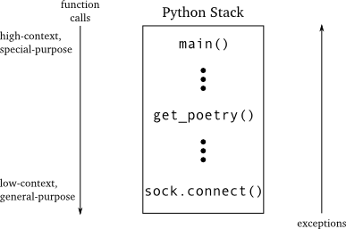
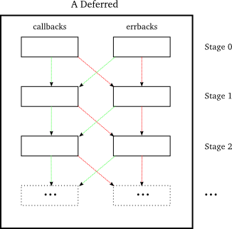
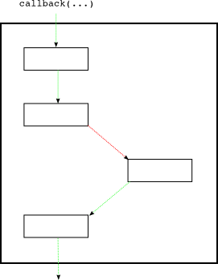

========================
パート9: Deferred 再入門
========================

コールバックのさらなる影響
--------------------------
コールバックについてもう一度考えるために、一息休憩を入れましょう。
Twisted 風に簡単な非同期プログラムを書くのに十分なほど遅延オブジェクトのことは理解できてきましたが、 ``Deferred`` はもっと複雑な設定をすればさらに多くの機能を提供してくれます。
ということで、もっと複雑な設定をいくつか練り上げて、コールバックを伴ったプログラミングでそれらがどのような種類の挑戦に直面するかを考えます。
それらにどうやって立ち向かっているかをみていきましょう。

議論を盛り上げるために、私たちの詩のクライアントに仮想的な機能を追加することにしましょう。
コンピュータ・サイエンスの教授が詩に関連する新しいアルゴリズム、"Byronification Engine"、を考え出すときに直面する問題を想像してみてください。
この無限アルゴリズムは入力としてひとつの詩を受け取って、元の詩に似ていますが `Lord Byron`_ 風に記述された新しい詩を生成します。
さらには、私たちの先生は親切なことに Python でお手本となる実装を提供してくれています。こんなインターフェイスです。

.. _Lord Byron: http://en.wikipedia.org/wiki/George_Gordon_Byron,_6th_Baron_Byron

::

    class IByronificationEngine(Interface):

        def byronificate(poem):
            """
            Return a new poem like the original, but in the style of Lord Byron.

            Raises GibberishError if the input is not a genuine poem.
            """

たいていの最先端のソフトウェアのように、この実装にはいくつかのバグがあります。文書化された例外に加えて、 ``byronificate`` メソッドはときどきランダムな例外を送出します。教授が対処し忘れた滅多に発生しない状況に嵌ったときです。

また、reactor の扱いに悩まされることなくメインスレッドで単純に呼び出せるくらいに、このエンジンが十分高速に実行できると仮定しましょう。私たちのプログラムには以下のように動作して欲しいのです。

#. 詩のダウンロードを試みなさい。
#. ダウンロードに失敗したら、詩を取得できなかったとユーザに伝えなさい。
#. 詩を取得できたら、Byronification エンジンを使って変換しなさい。
#. エンジンが ``GibberishError`` を送出したら、詩を取得できなかったとユーザに伝えなさい。
#. エンジンがその他の例外を送出したら、元の詩をそのままにしておきなさい。
#. 詩を持っていれば出力しなさい。
#. プログラムを終了しなさい。

ここでの考え方では、 ``GibberishError`` は私たちが実際の詩をまったく取得できなかったことを意味します。このため、ユーザにダウンロードが失敗したとだけ伝えることになるでしょう。これはデバッグするときには全く持って役に立ちませんが、ユーザは詩を得られたかどうかを知りたいだけなのです。他方で、もしもエンジンが他の理由で失敗したら、サーバから取得した詩をそのまま使うことになるでしょう。結局のところ、たとえそれが Byron 式の特徴をもっていなくても、ある詩が他のものより劣っているなんてことはないのです。

同期バージョンのコードはこんな感じになります。
::

    try:
        poem = get_poetry(host, port) # synchronous get_poetry
    except:
        print >>sys.stderr, 'The poem download failed.'
    else:
        try:
            poem = engine.byronificate(poem)
        except GibberishError:
            print >>sys.stderr, 'The poem download failed.'
        except:
            print poem # handle other exceptions by using the original poem
        else:
            print poem

    sys.exit()

いくらかリファクタリングすればプログラムの概要をもっと簡単にできるでしょう。しかし、この状態はロジックの流れをとても明確に表しています。
これと同じ枠組みを実装して、一番直近の詩のクライアント (遅延オブジェクトを使うものです) を更新したいのです。
しかし、パート10まではやりません。
今のところはかわりに `クライアント 3.1`_ でどうやるのかを想像してみましょう。これは遅延オブジェクトを全く使っていない最後のクライアントです。
例外を扱うのに悩まなかったと仮定してみると、代わりに `get_poem`_ コールバックを次のように変更するだけでした。

.. _クライアント 3.1: http://github.com/jdavisp3/twisted-intro/blob/master/twisted-client-3/get-poetry-1.py
.. _get_poem: http://github.com/jdavisp3/twisted-intro/blob/master/twisted-client-3/get-poetry-1.py#L106

::

    def got_poem(poem):
        poems.append(byron_engine.byronificate(poem))
        poem_done()

``byronificate`` メソッドが ``GibberishError`` かその他の例外を送出すると何が起きるでしょうか？パート6の":ref:`figure11`"を見ると、以下に挙げることが分かります。

#. ファクトリ内の ``poem_finished`` コールバックまで例外は広がるでしょう。このメソッドが実際にコールバックを呼び出しています。
#. ``poem_finished`` は例外を捕捉しませんので、プロトコルの ``poemReceived`` まで呼び出しが続くでしょう。
#. そして ``connectionLost`` まで続きます。これもプロトコルの中です。
#. Twisted 自身の内部まで続いていくと、最終的には reactor で終了します。

ここまで学んできたように、reactor はクラッシュせずに例外を捕捉してログを出力します。
しかし、ユーザに詩をダウンロードできなかったとは伝えてくれないでしょう。
reactor は詩のことも ``GibberishError`` のことも知りません。全ての種類のネットワーキングで使われる汎用的なコードだからです。詩には関係ないネットワーキングでさえも使われるのです。

上で述べた４つのそれぞれのステップで、例外はひとつ前のステップよりも一般的な目的のコードに移ることに気をつけましょう。
そして、 私たちがこのクライアントに望むような特定の方法でエラーを扱うコード片の中の例外には、 ``get_poem`` の後にステップがありません。
この状況は同期コードで例外が伝播していくのとは基本的に真逆です。

図15を見てください。同期版の詩のクライアントで目にするコールスタックを表しています。

.. _figure15:

    図１５：同期コードと例外

``main`` 関数は高コンテキストです。なぜそこに存在するのか、どうやって振舞うべきかをプログラム全体に渡って知っているということです。
典型的に ``main`` はユーザがプログラムにどうやって動いて欲しいか (そしておそらく、問題が生じたときに何をすべきか) を指示するコマンドラインオプションにアクセスするでしょう。
また、非常に限定された目的も持ちます。コマンドラインの詩のクライアントが動く方法です。

他方で、ソケットの ``connect`` メソッドは低コンテキストです。
何らかのネットワークアドレスに接続すると考えられていることしか知りません。
接続先が何であるかや、なんでそれに今すぐ接続する必要があるのかを知りません。
しかし、 ``connect`` は極めて汎用的な目的を持っています。あなたが接続しようとしているサービスが何であっても、それを使えるのです。

``get_poetry`` はその中間にあります。
何らかの詩を取得していることを知っています。それが唯一のできることです。けれども、もしそれができないときは何が起きるべきでしょうか。

``connect`` が投げた例外は、低コンテキストで汎用的なコードから高コンテキストで特定の目的のコードに向かってスタックを登っていくでしょう。何かおかしいことが起きたときに何をすべきかを知っている (もしくは Python インタープリタを引っぱたいてプログラムをクラッシュさせてしまう) 十分なコンテキストを持つ何らかのコードに到達するまでです。

もちろん例外は、文字通り高コンテキストのコードを探しながらというよりは、それが何であれ単にスタックを上がっていくだけです。
典型的な同期プログラムでは、「スタックを上がる」と「高コンテキストに向かう」は同じ方向性のことです。

.. up the stack
.. towards higher-context

ここで、上のクライアント 3.1 に対する理論的な変更を思い出してください。
私たちが分析したコールスタックは図16で図にしました。いくつかの関数は簡易表記にしてあります。

.. _figure16:

.. figure:: images/p09_async-exceptions4.png

    図１６：非同期コールバックと例外

問題点は明確ですね。
コールバックの中で、低コンテキストのコード (reactor) が高コンテキストのコードを呼び出しています。
このため、例外が発生したときに、それが即座に処理されないで発生したのと同じスタックフレームで閉じられないと、処理されない例外になってしまいます。
例外がスタックを上がっていくたびに低コンテキストなコードに移動していきますので、それが何をしているのか分かりにくくなります。

例外が Twisted の中心的な部分に立ち入ってしまうと、もうどうしようもありません。
例外を処理することはできず、記録されるだけになるでしょう (reactor が最終的にクラッシュさせます)。
このため、私たちが「昔ながらの簡易な」コールバック (遅延オブジェクトを使わないもの) を使ってプログラムを書くときは、Twisted 固有の部分に入り込んでしまう前に全ての例外を逃さないように注意しなくてはなりません。少なくとも、自分たちのルールに沿ってエラーを扱う機会を持ちたいならば。
私たち自身のバグによって引き起こされた例外も含みます。

バグは私たちのコードの至る所に存在しえますので、 ``try/except`` 節のもう一段階「外の層」ですべてのコールバックを包む必要があります。これによって、打ち間違いから起こる例外も同様に処理されるようになります。
同じことはエラー用コールバックにも当てはまります。エラーを処理するコードにも同様にバグの可能性がありますから。

それにしても、これはあまり良いやり方ではありませんね。

遅延オブジェクトを使った良い構造
--------------------------------
``Deferred`` クラスはこの種の問題を解決することを助けてくれることが分かりました。
遅延オブジェクトがコールバックかエラー用コールバックを呼び出すときはいつでも、引き起こされる可能性のあるいかなる例外も捕捉してくれます。
言い換えると、遅延オブジェクトは ``try/except`` 節の「外の層」のように動作してくれます。遅延オブジェクトを使っている限りは私たちはその層に関して全く記述する必要がありません。
といっても、遅延オブジェクトは自分が捕捉した例外に対して何をするのでしょうか？簡単です。チェーンの次のエラー用コールバックに例外 (``Failure`` 形式になっています) を渡していくだけです。

遅延オブジェクトに私たちが付け足した最初のエラー用コールバックは、遅延オブジェクトの ``errback(err)`` メソッドが呼ばれたときに通知されるいかなるエラーの状態も処理するために、そこで待ち受けてくれます。
けれども二番目のエラー用コールバックは、最初のコールバックか最初のエラー用コールバックによって引き起こされた全ての例外を処理するでしょう。
後続のものも順次そうなります。

:ref:`figure12` を思い出してください。チェーンにいくつかのコールバックとエラー用コールバックを持つ遅延オブジェクトの視覚的表現です。
最初のコールバックとエラー用コールバックのペアをステージ０、次のペアをステージ１、と順番にそのように呼ぶことにしましょう。

あるステージ **N** において、コールバックかエラー用コールバックのどちらか (実行された方です) が失敗したとすると、適切な ``Failure`` オブジェクトを伴ってステージ **N+1** のエラー用コールバックが呼ばれます。ステージ **N+1** のコールバックは呼び出されません。

チェーンを辿りながらコールバックによって引き起こされた例外を渡すことによって、遅延オブジェクトは「より高コンテキスト」の方向に例外を移動させます。
遅延オブジェクトの ``callback`` と ``errback`` メソッドを呼び出すことは、呼び出し元にとって (遅延オブジェクトを一回しか呼び出さない限り！) 決して例外という結果にはなりませんので、より低レベルのコードは、例外を捕捉することに関して心配することなく、安全に遅延オブジェクトを発火させることができます。
その代わりに、より高レベルのコードは遅延オブジェクトにエラー用コールバックを付け加える (``addErrback`` などで) ことで例外を捕捉します。

この同期コードでは、捕捉されるとすぐに例外は伝播することを止めます。
エラー用コールバックはどうやってそれがエラーを「捕まえた」という合図を送るのでしょうか？これもまた簡単なことです。例外を送出しないことでそうなります。
そしてこの場合は、実行しているものはコールバック上で切り替わります。
あるステージ **N** において、もしもコールバックかエラー用コールバックのどちらかが成功する (つまり例外を出さないということです) と、ステージ **N** からの戻り値を伴ってステージ **N+1** のコールバックが呼ばれます。ステージ **N+1** のエラー用コールバックは呼ばれません。

遅延オブジェクトが作動するパターンについて分かったことをまとめてみましょう。

#. 遅延オブジェクトは順序付けられたコールバックとエラー用コールバックのペア (ステージ) からなるチェーンを含みます。ペアは、それが遅延オブジェクトに付け加えられた順番通りに管理されます。
#. ステージ 0、最初のコールバックとエラー用コールバックのペアです、は遅延オブジェクトが発火されたときに呼び出されます。遅延オブジェクトが ``callback`` メソッドで発火されるとステージ 0 のコールバックが呼ばれます。 ``errback`` メソッドで発火されるとステージ 0 のエラー用コールバックが呼ばれます。
#. ステージ **N** が失敗すると、ステージ **N+1** のエラー用コールバックが例外 (``Failure`` でラップされています) を第一引数として呼ばれます。
#. ステージ **N** が成功すると、ステージ **N+1** のコールバックがステージ **N** の戻り値を第一引数として呼ばれます。

このパターンを図示したのが図17です。

.. _figure17:

    図１７：遅延オブジェクト内の制御の流れ

緑の線はコールバックかエラー用コールバックが成功したときに起こることを示し、赤い線は失敗したときを示します。
これらの線は制御の流れと例外および戻り値の流れの両方がチェーンを辿っていく様子を表します。
図17は遅延オブジェクトが通るかもしれない全ての可能性のパスを表しています。しかし、ある特定の場合に辿るのはたった一つのパスだけです。
図18は作動する可能性のあるひとつのパスを表します。

.. _figure18:

    図１８：遅延オブジェクトが作動するパターンのひとつ

図18では遅延オブジェクトの ``callback`` 関数が呼ばれます。それはステージ 0 のコールバックを呼び出します。そのコールバックは成功し、制御 (それと、ステージ 0 からの戻り値) はステージ 1 のコールバックに渡されます。しかし、ここでのコールバックは失敗 (例外を発生させます) し、ステージ 2 ではエラー用のコールバックに制御が移ります。エラー用コールバックはエラーを処理 (例外を発生させません) し、制御は通常のコールバックチェーンに戻ります。そして、ステージ 2 のエラー用コールバックの結果を伴ってステージ 3 のコールバックが呼び出されます。

図17で描けるどんなパスもチェーンのそれぞれのステージを通りますが、どのステージでもコールバックとエラー用コールバックのペアのどちらか片方しか呼び出されないことに気をつけてください。

図18では、ステージ 3 から緑の矢印を引っ張ることで、そのコールバックが成功しているように図示しています。しかし、この遅延オブジェクトにはそれ以降のステージがありませんので、ステージ 3 の結果は実際にはどこにも行きません。コールバックが成功すれば問題はありません。
しかし、そうでない場合はどうなるでしょうか？
もしも遅延オブジェクトの最後のステージで失敗してしまうと、それを捕捉するための ``errback`` がありませんので、その失敗は捕捉されなかったと言います。

同期版のコードでは捕捉されない例外はインタープリタをクラッシュさせてしまうでしょう。いわゆる普通の非同期コードでは、捕捉されない例外は reactor に捕まえられてログに出力されます。
遅延オブジェクト内の捕捉されない例外はどうなるでしょうか？
とりあえずやってみましょう。
`twisted-deferred/defer-unhandled.py`_ にあるサンプルコードを見てください。
このコードは、いつも例外を投げるコールバックをひとつ持つ遅延オブジェクトを発火させます。
プログラムからの出力は次のようになります。

.. _twisted-deferred/defer-unhandled.py: _http://github.com/jdavisp3/twisted-intro/blob/master/twisted-deferred/defer-unhandled.py#L1

.. code-block:: python

    Finished
    Unhandled error in Deferred:
    Traceback (most recent call last):
      ...
    --- <exception caught here> ---
      ...
    exceptions.Exception: oops

いくつか注意することがあります。

* 最後の ``print`` は実行されますので、例外によってプログラムがクラッシュしてしまうわけではありません。
* トレースバックが出力されるだけで、インタープリタをクラッシュさせるものではないことを意味します。
* トレースバックのテキストは遅延オブジェクト自身が例外を捕らえた場所を教えてくれます。
* "Unhandled" というメッセージは "Finished" の後に出力されています。

よって遅延オブジェクトを使うとき、コールバックで捕捉されない例外には、デバッグを目的として、引き続き注意が払われます。しかし、たいていはプログラムをクラッシュさせることにはなりません(実際、それらの例外は reactor に作用すらせず、遅延オブジェクトが真っ先に捕まえるでしょう)。
ところで "Finished" が最初にやってくる理由は、遅延オブジェクトがガベージコレクタに回収されるまで "Unhandled" メッセージが実際には出力されないからです。
その理由は先々のパートで見ていきましょう。

さて、同期コードでは引数無しで ``raise`` キーワードを使うことで例外を「再送出 (re-raise)」できます。そうすることで、扱っていた元々の例外を投げ、完全に処理することなくエラーに対していくつかの操作を実行できます。
エラー用コールバックで全く同様のことができますね。
もしも次の条件のどちらかを満たすなら、遅延オブジェクトはコールバックおよびエラー用コールバックが失敗したとみなすでしょう。

* コールバックかエラー用コールバックが何らかの種類の例外を発生させる。
* コールバックかエラー用コールバックが ``Failure`` オブジェクトを返す。

エラー用コールバックの最初の引数は常に ``Failure`` なので、エラー用コールバックはそこで実行したいことを実施した後に最初の引数を戻り値とすることで例外を「再送出 (re-raise)」できます。

コールバックとエラー用コールバック、２の２乗
--------------------------------------------
以上の議論から明らかなことのひとつは、遅延オブジェクトにコールバックとエラー用コールバックを追加する順番には、遅延オブジェクトがどうやって発火するかで大きな違いがあることです。
遅延オブジェクトについてもうひとつ明らかなことは、コールバックとエラー用コールバックはいつもペアで起こる、ということです。
Deferred_ クラスには、チェーンにペアを追加するために使える四つのメソッドがあります。

.. _Deferred: http://twistedmatrix.com/trac/browser/tags/releases/twisted-8.2.0/twisted/internet/defer.py#L172

#. ``addCallbacks``
#. ``addCallback``
#. ``addErrback``
#. ``addBoth``

名前からも明らかですが、最初と最後のメソッドはチェーンにペアを追加します。
しかし、真ん中の二つのメソッドもコールバックとエラー用コールバックのペアを追加します。
``addCallback`` メソッドは明示的なコールバック (メソッドに渡す引数) と、暗黙的な「何もしない (pass-through)」エラー用コールバックを追加します。
何もしない関数とは、最初の引数を返すだけのダミー関数です。
エラー用コールバックへの第一引数はいつも ``Failure`` なので、何もしないエラー用コールバックは常に失敗し、チェーンの次のエラー用コールバックにエラーを送ります。

あなたが間違いなく思った通りに、 ``addErrback`` 関数は明示的なエラー用コールバックと暗黙的な何もしないコールバックを追加します。
コールバックへの第一引数は ``Failure`` ではありませんので、何もしないコールバックはチェーンの次のコールバックにその結果を送ります。

遅延オブジェクトのシミュレータ
------------------------------
遅延オブジェクトがコールバックとエラー用コールバックを実行させる方法に慣れていくのは良いことです。
`twisted-deferred/deferred-simulator.py`_ の Python スクリプトは「遅延オブジェクトのシミュレータ (deferred simulator)」です。遅延オブジェクトが発火する様子を探っていくための小さな Python プログラムです。
スクリプトを実行すると、コールバックとエラー用コールバックのペアの一覧を一行ずつ入力するように促されます。
それぞれのコールバックもしくはエラー用コールバックは次のいずれかです。

.. _twisted-deferred/deferred-simulator.py: http://github.com/jdavisp3/twisted-intro/blob/master/twisted-deferred/deferred-simulator.py#L1

* 与えられた値を返すもの (成功)
* 与えられた例外を発生させるもの (失敗)
* 引数をそのまま返すもの (何もしない)

シミュレートしたい全ての組み合わせを入力するとスクリプトが出力を生成します。高解像度のアスキー・アートで、ダイアグラムがチェーンの内容と、 ``callback`` および ``errback`` メソッドで発火されるパターンを表します。
全てを正確に見るために、ターミナルを開いているウィンドウをできるだけ広く使いたくなるでしょう。
ダイアグラムをひとつずつ出力させるためには ``--narrow`` オプションを使うこともできます。
しかし、横同士に出力させた方がそれらの関係を確認しやすいでしょう。

もちろん実際のコードでは、コールバックが毎回同じ値を返すことはありませんし、ある関数は成功したり失敗したりします。
しかしこのシミュレータは、あるコールバックとエラー用コールバックの設定において、通常の結果と失敗の組み合わせの場合に何が起こるかを図示してくれます。

まとめ
------
コールバックを使ったプログラミングは低コンテキストと高コンテキストのコードの間にある通常の関係を反転させますので、コールバックについてより深く考えた後では、コールバックに例外をスタックに積み上げさせても同様には動作しないことに気付きます。
そして ``Deferred`` クラスは例外を捕捉し、その例外を上位コンテキストの reactor に受け渡すのではなくチェーンの下位コンテキストに送っていくことで、この問題に取り組んでくれます。

通常の結果 (値を返します; ``return``) が同様にチェーンを下っていくことも学びました。
この二つの事実の組み合わせは、往来する発火パターン (原文; criss-cross firing pattern) の一種ということになります。
遅延オブジェクトがそれぞれのステージにおける結果次第で、コールバックとエラー用コールバックで繋がれた線上を行ったりきたりするからです。

この知識を身に付けて、":doc:`p10`"では、私たちが作っている詩のクライアントをいくつかの詩の変換ロジックで書き換えていきましょう。

おすすめの練習問題
------------------
* Deferred_ における四つそれぞれのメソッドの実装を調査しましょう。コールバックとエラー用コールバックを追加するものです。全てのメソッドがコールバックのペアを追加することを確認してください。
* このコードの違いを調査するために遅延オブジェクトのシミュレータを使ってください。
    ::

        deferred.addCallbacks(my_callback, my_errback)

    もうひとつはこのコードです。
    ::

        deferred.addCallback(my_callback)
        deferred.addErrback(my_errback)

    後のふたつのメソッドはペアのうちの片方のメンバーとして暗黙的に関数を受け渡すことを思い出してください。

.. _Deferred: http://twistedmatrix.com/trac/browser/tags/releases/twisted-8.2.0/twisted/internet/defer.py#L172

..
    <H2>Part 9: A Second Interlude, Deferred
    This continues the introduction started <A href="http://krondo.com/blog/?p=1209">here</A>. You can find an index to the entire series <A href="http://krondo.com/blog/?page_id=1327">here</A>.
    <H3>More Consequence of Callbacks
    We're going to pause for a moment to think about callbacks again. Although we now know enough about deferreds to write simple asynchronous programs in the Twisted style, the <CODE>Deferred</CODE> class provides more features that only come into play in more complex settings. So we're going to think up some more complex settings and see what sort of challenges they pose when programming with callbacks. Then we'll investigate how deferreds address those challenges.
    To motivate our discussion we're going to add a hypothetical feature to our poetry client. Suppose some hard-working Computer Science professor has invented a new poetry-related algorithm, the Byronification Engine. This nifty algorithm takes a single poem as input and produces a new poem like the original, but written in the style of <A href="http://en.wikipedia.org/wiki/George_Gordon_Byron,_6th_Baron_Byron">Lord Byron</A>. What's more, our professor has kindly provided a reference implementation in Python, with this interface:
    class IByronificationEngine(Interface):

        def byronificate(poem):
            """
            Return a new poem like the original, but in the style of Lord Byron.

            Raises GibberishError if the input is not a genuine poem.
            """
    Like most bleeding-edge software, the implementation has some bugs. This means that in addition to the documented exception, the <CODE>byronificate</CODE> method sometimes throws random exceptions when it hits a corner-case the professor forgot to handle.
    We'll also assume the engine runs fast enough that we can just call it in the main thread without worrying about tying up the reactor. This is how we want our program to work:
    <OL>
    * Try to download the poem.
    * If the download fails, tell the user we couldn't get the poem.
    * If we do get the poem, transform it with the Byronification Engine.
    * If the engine throws a <CODE>GibberishError</CODE>, tell the user we couldn't get the poem.
    * If the engine throws another exception, just keep the original poem.
    * If we have a poem, print it out.
    * End the program.
    </OL>
    The idea here is that a <CODE>GibberishError</CODE> means we didn't get an actual poem after all, so we'll just tell the user the download failed. That's not so useful for debugging, but our users just want to know whether we got a poem or not. On the other hand, if the engine fails for some other reason then we'll use the poem we got from the server. After all, some poetry is better than none at all, even if it's not in the trademark Byron style.
    Here's the synchronous version of our code:
    try:
        poem = get_poetry(host, port) # synchronous get_poetry
    except:
        print &gt;&gt;sys.stderr, 'The poem download failed.'
    else:
        try:
            poem = engine.byronificate(poem)
        except GibberishError:
            print &gt;&gt;sys.stderr, 'The poem download failed.'
        except:
            print poem # handle other exceptions by using the original poem
        else:
            print poem

    sys.exit()
    This sketch of a program could be make simpler with some refactoring, but it illustrates the flow of logic pretty clearly. We want to update our most recent poetry client (which uses deferreds) to implement this same scheme. But we won't do that until Part 10. For now, instead, let's imagine how we might do this with <A href="http://github.com/jdavisp3/twisted-intro/blob/master/twisted-client-3/get-poetry-1.py">client 3.1</A>, our last client that didn't use deferreds at all. Suppose we didn't bother handling exceptions, but instead just changed the <A href="http://github.com/jdavisp3/twisted-intro/blob/master/twisted-client-3/get-poetry-1.py#L106"><CODE>got_poem</CODE></A> callback like this:
    def got_poem(poem):
        poems.append(byron_engine.byronificate(poem))
        poem_done()
    What happens when the <CODE>byronificate</CODE> method raises a <CODE>GibberishError</CODE> or some other exception? Looking at <A href="http://krondo.com/blog/?p=1595#figure11">Figure 11</A> from Part 6, we can see that:
    <OL>
    * The exception will propagate to the <CODE>poem_finished</CODE> callback in the factory, the method that actually invokes the callback.
    * Since <CODE>poem_finished</CODE> doesn't catch the exception, it will proceed to <CODE>poemReceived</CODE> on the protocol.
    * And then on to <CODE>connectionLost</CODE>, also on the protocol.
    * And then up into the core of Twisted itself, finally ending up at the reactor.
    </OL>
    As we have learned, the reactor will catch and log the exception instead of crashing. But what it certainly won't do is tell the user we couldn't download a poem. The reactor doesn't know anything about poems or <CODE>GibberishError</CODE>s, it's a general-purpose piece of code used for all kinds of networking, even non-poetry-related networking.
    Notice how, at each step in the list above, the exception moves to a more general-purpose piece of code than the one before. And at no step after <CODE>got_poem</CODE> is the exception in a piece of code that could be expected to handle an error in the specific way we want for this client. This situation is basically the exact opposite of the way exceptions propagate in synchronous code.
    Take a look at Figure 15, an illustration of  a call stack we might see with a synchronous poetry client:
    

Figure 15: synchronous code and exceptions

    The <CODE>main</CODE> function is "high-context", meaning it knows a lot about the whole program, why it exists, and how it's supposed to behave overall. Typically, <CODE>main</CODE> would have access to the command-line options that indicate just how the user wants the program to work (and perhaps what to do if something goes wrong). It also has a very specific purpose: running the show for a command-line poetry client.
    The socket <CODE>connect</CODE> method, on the other hand, is "low-context". All it knows is that it's supposed to connect to some network address. It doesn't know what's on the other end or why we need to connect right now. But <CODE>connect</CODE> is quite general-purpose — you can use it no matter what sort of service you are connecting to.
    And <CODE>get_poetry</CODE> is in the middle. It knows it's getting some poetry (and that's the only thing it's really good at), but not what should happen if it can't.
    So an exception thrown by  <CODE>connect</CODE> will&nbsp; move up the stack, from low-context and general-purpose code to high-context and special-purpose code, until it reaches some code with enough context to know what to do when something goes wrong (or it hits the Python interpreter and the program crashes).
    Of course the exception is really just moving up the stack no matter what rather than literally seeking out high-context code. It's just that in a typical synchronous program "up the stack" and "towards higher-context" are the same direction.
    Now recall our hypothetical modification to client 3.1 above. The call stack we analyzed is pictured in Figure 16, abbreviated to just a few functions:
    

Figure 16: asynchronous callbacks and exceptions

    The problem is now clear: during a callback, low-context code (the reactor) is calling higher-context code which may in turn call even higher-context code, and so on. So if an exception occurs and it isn't handled immediately, close to the same stack frame where it occurred, it's unlikely to be handled at all. Because each time the exception moves up the stack it moves to a piece of lower-context code that's even less likely to know what to do.
    Once an exception crosses over into the Twisted core the game is up. The exception will not be handled, it will only be noted (when the reactor finally catches it). So when we are programming with "plain old" callbacks (without using deferreds), we must be careful to catch every exception before it gets back into Twisted proper, at least if we want to have any chance of handling errors according to our own rules. And that includes exceptions caused by our own bugs!
    Since a bug can exist anywhere in our code, we would need to wrap every callback we write in an extra "outer layer" of <CODE>try</CODE>/<CODE>except</CODE> statements so the exceptions from our fumble-fingered typos can be handled as well. And the same goes for our errbacks because code to handle errors can have bugs too.
    Well that's not so nice.
    <H3>The Fine Structure of Deferreds
    It turns out the <CODE>Deferred</CODE> class helps us solve this problem. Whenever a deferred invokes a callback or errback, it catches any exception that might be raised. In other words, a deferred acts as the "outer layer" of <CODE>try</CODE>/<CODE>except</CODE> statements so we don't need to write that layer after all, as long as we use deferreds. But what does a deferred do with an exception it catches? Simple — it passes the exception (in the form of a <CODE>Failure</CODE>) to the next errback in the chain.
    So the first errback we add to a deferred is there to handle whatever error condition is signaled when the deferred's <CODE>.errback(err)</CODE> method is called. But the second errback will handle any exception raised by either the first callback or the first errback, and so on down the line.
    Recall <A href="http://krondo.com/blog/?p=1682#figure12">Figure 12</A>, a visual representation of a deferred with some callbacks and errbacks in the chain. Let's call the first callback/errback pair stage 0, the next pair stage 1, and so on.
    At a given stage <STRONG>N</STRONG>,  if either the callback or the errback (whichever was executed) fails, then the errback in stage <STRONG>N+1</STRONG> is called with the appropriate <CODE>Failure</CODE> object and the callback in stage <STRONG>N+1</STRONG> is <EM>not</EM> called.
    By passing exceptions raised by callbacks "down the chain", a deferred moves exceptions in the direction of "higher context". This also means that invoking the <CODE>callback</CODE> and <CODE>errback</CODE> methods of a deferred will never result in an exception for the caller (as long as you only fire the deferred once!), so lower-level code can safely fire a deferred without worrying about catching exceptions. Instead, higher-level code catches the exception by adding errbacks to the deferred (with <CODE>addErrback</CODE>, etc.).
    Now in synchronous code, an exception stops propagating as soon as it is caught. So how does an errback signal the fact that it "caught" the error? Also simple — by <EM>not</EM> raising an exception. And in that case, the execution switches over to the callback line. So at a given stage <STRONG>N</STRONG>, if either the callback or errback succeeds (i.e., doesn't raise an exception) then the callback in stage <STRONG>N+1</STRONG> is called with the return value from stage <STRONG>N</STRONG>, and the errback in stage <STRONG>N+1</STRONG> is <EM>not</EM> called.
    Let's summarize what we know about the deferred firing pattern:
    <OL>
    * A deferred contains a chain of ordered callback/errback pairs (stages). The pairs are in the order they were added to the deferred.
    * Stage 0, the first callback/errback pair, is invoked when the deferred is fired. If the deferred is fired with the <CODE>callback</CODE> method, then the stage 0 callback is called. If the deferred is fired with the <CODE>errback</CODE> method, then the stage 0 errback is called.
    * If stage <STRONG>N</STRONG> fails, then the stage <STRONG>N+1</STRONG> errback is called with the exception (wrapped in a <CODE>Failure</CODE>) as the first argument.
    * If stage <STRONG>N</STRONG> succeeds, then the stage <STRONG>N+1</STRONG> callback is called with the stage <STRONG>N</STRONG> return value as the first argument.
    </OL>
    This pattern is illustrated in Figure 17:
    

Figure 17: control flow in a deferred

    The green lines indicate what happens when a callback or errback succeeds and the red lines are for failures. The lines show both the flow of control and the flow of exceptions and return values down the chain. Figure 17 shows all possible paths a deferred might take, but only one path will be taken in any particular case. Figure 18 shows one possible path for a "firing":
    

Figure 18: one possible deferred firing pattern

    In figure 18, the deferred's <CODE>callback</CODE> method is called, which invokes the callback in stage 0. That callback succeeds, so control (and the return value from stage 0) passes to the stage 1 callback. But that callback fails (raises an exception), so control switches to the errback in stage 2. The errback "handles" the error (it doesn't raise an exception) so control moves back to the callback chain and the callback in stage 3 is called with the result from the stage 2 errback.
    Notice that any path you can make with Figure 17 will pass through every stage in the chain, but only one member of the callback/errback pair at any stage will be called.
    In Figure 18, we've indicated that the stage 3 callback succeeds by drawing a green arrow out of it, but since there aren't any more stages in that deferred, the result of stage 3 doesn't really go anywhere. If the callback succeeds, that's not really a problem, but what if it had failed? If the last stage in a deferred fails, then we say the failure is <EM>unhandled</EM>, since there is no errback to "catch" it.
    In synchronous code an unhandled exception will crash the interpreter, and in plain-old-callbacks asynchronous code an unhandled exception is caught by the reactor and logged. What happens to unhandled exceptions in deferreds? Let's try it out and see. Look at the sample code in <A href="http://github.com/jdavisp3/twisted-intro/blob/master/twisted-deferred/defer-unhandled.py#L1"><TT>twisted-deferred/defer-unhandled.py</TT></A>. That code is firing a deferred with a single callback that always raises an exception. Here's the output of the program:
    Finished
    Unhandled error in Deferred:
    Traceback (most recent call last):
      ...
    --- &lt;exception caught here&gt; ---
      ...
    exceptions.Exception: oops
    Some things to notice:
    <OL>
    * The last <CODE>print</CODE> statement runs, so the program is not "crashed" by the exception.
    * That means the Traceback is just getting printed out, it's not crashing the interpreter.
    * The text of the traceback  tells us where the deferred itself caught the exception.
    * The "Unhandled" message gets printed out after "Finished".
    </OL>
    So when you use deferreds, unhandled exceptions in callbacks will still be noted, for debugging purposes, but as usual they won't crash the program (in fact they won't even make it to the reactor, the deferred will catch them first). By the way, the reason that "Finished" comes first is because the "Unhandled" message isn't actually printed until the deferred is garbage collected. We'll see the reason for that in a future Part.
    Now, in synchronous code we can "re-raise" an exception using the <CODE>raise</CODE> keyword without any arguments. Doing so raises the original exception we were handling and allows us to take some action on an error without completely handling it. It turns out we can do the same thing in an errback. A deferred will consider a callback/errback to have failed if:
    <UL>
    * The callback/errback raises any kind of exception, or
    * The callback/errback returns a <CODE>Failure</CODE> object.
    </UL>
    Since an errback's first argument is always a <CODE>Failure</CODE>, an errback can "re-raise" the exception by returning its first argument, after performing whatever action it wants to take.
    <H3>Callbacks and Errbacks, Two by Two
    One thing that should be clear from the above discussion is that the order you add callbacks and errbacks to a deferred makes a big difference in how the deferred will fire. What should also be clear is that, in a deferred,&nbsp;callbacks and errbacks always occur in pairs. There are four methods on the <A href="http://twistedmatrix.com/trac/browser/tags/releases/twisted-8.2.0/twisted/internet/defer.py#L172"><CODE>Deferred</CODE></A> class you can use to add pairs to the chain:
    <OL>
    * <CODE>addCallbacks</CODE>
    * <CODE>addCallback</CODE>
    * <CODE>addErrback</CODE>
    * <CODE>addBoth</CODE>
    </OL>
    Obviously, the first and last methods add a pair to the chain. But the middle two methods also add a callback/errback pair. The <CODE>addCallback</CODE> method adds an explicit callback (the one you pass to the method) and an implicit "pass-through" errback. A pass-through function is a dummy function that just returns its first argument. Since the first argument to an errback is always a <CODE>Failure</CODE>, a pass-through errback will always "fail" and send its error to the next errback in the chain.
    As you've no doubt guessed, the <CODE>addErrback</CODE> function adds an explicit errback and an implicit pass-through callback. And since the first argument to a callback is never a <CODE>Failure</CODE>, a pass-through callback sends its result to the next callback in the chain.
    <H3>The Deferred Simulator
    It's a good idea to become familiar with the way deferreds fire their callbacks and errbacks. The python script in <A href="http://github.com/jdavisp3/twisted-intro/blob/master/twisted-deferred/deferred-simulator.py#L1"><TT>twisted-deferred/deferred-simulator.py</TT></A> is a "deferred simulator", a little python program that lets you explore how deferreds fire. When you run the script it will ask you to enter list of callback and errback pairs, one per line. For each callback or errback, you specify that either:
    <UL>
    * It returns a given value (succeds), or
    * It raises a given exception (fails), or
    * It returns its argument (passthru).
    </UL>
    After you've entered all the pairs you want to simulate, the script will print out, in high-resolution ASCII art, a diagram showing the contents of the chain and the firing patterns for the <CODE>callback</CODE> and <CODE>errback</CODE> methods. You will want to use a terminal window that is as wide as possible to see everything correctly. You can also use the <TT>--narrow</TT> option to print the diagrams one after the other, but it's easier to see their relationships when you print them side-by-side.
    Of course, in real code a callback isn't going to return the same value every time, and a given function might sometimes succeed and other times fail. But the simulator can give you a picture of what will happen for a given combination of normal results and failures, in a given arrangement of callbacks and errbacks.
    <H3>Summary
    After thinking some more about callbacks, we realize that letting callback exceptions  bubble up the stack isn't going to work out so well, since callback programming inverts the usual relationship between low-context and high-context code. And  the Deferred class tackles this problem by catching exceptions and sending them down the chain instead of up into the reactor.
    We've also learned that ordinary results (<CODE>return</CODE> values)  move down the chain as well. Combining both facts together results in a kind of criss-cross firing pattern as the deferred switches back and forth between the callback and errback lines, depending on the result of each stage.
    Armed with this knowledge, in <A href="http://krondo.com/blog/?p=1956">Part 10</A> we will update our poetry client with some poetry transformation logic.
    <H3>Suggested Exercises
    <OL>
    * Inspect the implementation of each of the four methods on the <A href="http://twistedmatrix.com/trac/browser/tags/releases/twisted-8.2.0/twisted/internet/defer.py#L172"><CODE>Deferred</CODE></A> which add callbacks and errbacks. Verify that all methods add a callback/errback pair.
    * Use the deferred simulator to investigate the difference between this code:
    deferred.addCallbacks(my_callback, my_errback)
    and this code:
    deferred.addCallback(my_callback)
    deferred.addErrback(my_errback)
    Recall that the last two methods add implicit pass-through functions as one member of the pair.
    </OL>
