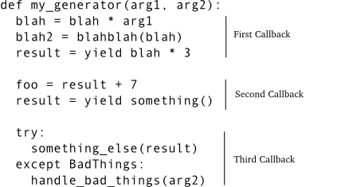
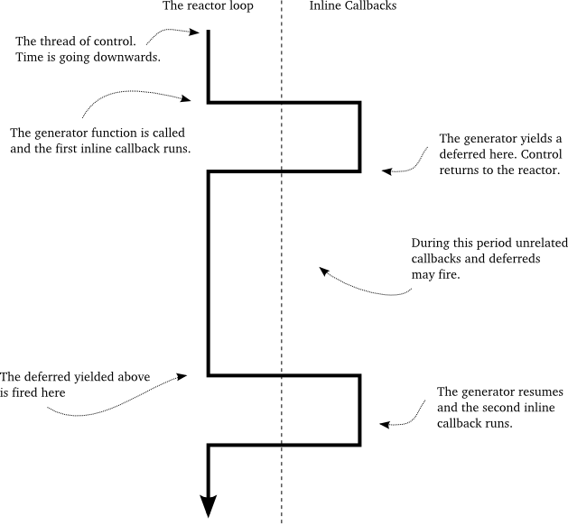

======================================
パート17: 「コールバック」ではない方法
======================================
..
    <H2>Part 17: Just Another Way to Spell "Callback"

はじめに
========
..
    <H3>Introduction

このパートではコールバックに主眼を置き直します。
Twisted で `generators <http://docs.python.org/tutorial/classes.html#generators>`_ を使ってコールバックを記述するもうひとつのテクニックを紹介しましょう。
このやり方がどうやって動くのかを示し、純粋な ``Deferred`` を使う場合と照らし合わせてみます。
最後に、このテクニックを使って詩のクライアントのひとつを書き直しましょう。
とはいえ、なんでこの手法がコールバックを生成するのにふさわしいかを理解するために、まずはジェネレータの動作を復習しておきましょうか。

..
    In this Part we're going to return to the subject of callbacks. We'll introduce another technique for writing callbacks in Twisted that uses <A href="http://docs.python.org/tutorial/classes.html#generators">generators</A>. We'll show how the technique works and contrast it with using "pure" Deferreds. Finally we'll rewrite one of our poetry clients using this technique. But first let's review how generators work so we can see why they are a candidate for creating callbacks.

ジェネレータに関する簡単な復習
------------------------------
..
    <H4>A Brief Review of Generators

ご存知のように、Python のジェネレータは関数内で ``yield`` を使って生成できる "restartable function" (TODO: 公式ドキュメントの和訳を見ておく) です。
こうすることで、ある関数は、一連のステップ内で実行するために利用できる `iterator <http://docs.python.org/tutorial/classes.html#iterators>`_ 
(イテレータ) を返す、ジェネレータ関数になります。
イテレータのそれぞれのサイクルは関数を再始動させ、次の ``yield`` に達するまで処理を続けます。

..
    As you probably know, a Python generator is a "restartable function" that you create by using the ``yield`` expression in the body of your function. By doing so, the function becomes a "generator function" that returns an <A href="http://docs.python.org/tutorial/classes.html#iterators">iterator</A> you can use to run the function in a series of steps. Each cycle of the iterator restarts the function, which proceeds to execute until it reaches the next ``yield``.

ジェネレータ (と、イテレータ) はしばしば lazily-created sequences of values (TODO: 日本語を調べる/考える) を表現するために使われます。
`inline-callbacks/gen-1.py <http://github.com/jdavisp3/twisted-intro/blob/master/inline-callbacks/gen-1.py#L1>`_ にあるサンプルコードを見てみましょう。
::

    def my_generator():
        print 'starting up'
        yield 1
        print "workin'"
        yield 2
        print "still workin'"
        yield 3
        print 'done'

    for n in my_generator():
        print n

..
    Generators (and iterators) are often used to represent lazily-created sequences of values. Take a look at the example code in <A href="http://github.com/jdavisp3/twisted-intro/blob/master/inline-callbacks/gen-1.py#L1"><TT>inline-callbacks/gen-1.py</TT></A>:
    def my_generator():
        print 'starting up'
        yield 1
        print "workin'"
        yield 2
        print "still workin'"
        yield 3
        print 'done'

    for n in my_generator():
        print n

ここでは、ジェネレータに 1, 2, 3 というシーケンスを生成させています。
コードを実行させてみると、ジェネレータの ``print`` 文が ``for`` ループ内の ``print`` 文にそれぞれのループで織り交ぜられていることが分かるでしょう。

..
    Here we have a generator that creates the sequence 1, 2, 3. If you run the code, you will see the ``print`` statements in the generator interleaved with the ``print`` statement in the ``for`` loop as the loop cycles through the generator.

ジェネレータ自身を生成することで、このコードをもっと明示的にすることもできます。
(`inline-callbacks/gen-2.py <http://github.com/jdavisp3/twisted-intro/blob/master/inline-callbacks/gen-2.py#L1>`_):
::

    def my_generator():
        print 'starting up'
        yield 1
        print "workin'"
        yield 2
        print "still workin'"
        yield 3
        print 'done'

    gen = my_generator()

    while True:
        try:
            n = gen.next()
        except StopIteration:
            break
        else:
            print n

..
    We can make this code more explicit by creating the generator ourselves (<A href="http://github.com/jdavisp3/twisted-intro/blob/master/inline-callbacks/gen-2.py#L1"><TT>inline-callbacks/gen-2.py</TT></A>):
    def my_generator():
        print 'starting up'
        yield 1
        print "workin'"
        yield 2
        print "still workin'"
        yield 3
        print 'done'

    gen = my_generator()

    while True:
        try:
            n = gen.next()
        except StopIteration:
            break
        else:
            print n

シーケンスとして考えてみると、ジェネレータは後続の値を取得するためのオブジェクトにすぎません。
しかし、ジェネレータ自身の観点から考えてみることもできます。

1. ジェネレータ関数はループによって呼び出されるまで動き出しません (``next`` メソッドを使います)。
2. ジェネレータ関数が動き出すと、ループに処理を返すまで動き続けます (``yield`` を使います)。
3. ループが他のコード (``print`` 文のように) を実行しているときは、ジェネレータは動作していません。
4. ジェネレータが動作しているときは、ループは動作していません (ジェネレータを待つためにブロックされています)。
5. ジェネレータがループに制御を委譲 (``yield``) すると、ジェネレータが再度実行されるまで、任意の時間が渡されます (さらに任意の量のコードが実行されるかもしれません)。

..
    Considered as a sequence, the generator is just an object for getting successive values. But we can also view things from the point of view of the generator itself:

    * The generator function doesn't start running until "called" by the loop (using the ``next`` method).
    * Once the generator is running, it keeps running until it "returns" to the loop (using ``yield``).
    * When the loop is running other code (like the ``print`` statement), the generator is not running.
    * When the generator is running, the loop is not running (it's "blocked" waiting for the generator).
    * Once a generator ``yield``s control to the loop, an arbitrary amount of time may pass (and an arbitrary amount of other code may execute) until the generator runs again.

非同期システムにおけるコールバックの動作とそっくりですね。
``while`` ループを reactor、ジェネレータを ``yield`` 文で分割された一連のコールバックとみなせます。
すべてのコールバックは同じローカル変数の名前空間を共有し、その名前空間はあるコールバックから次のコールバックに引き継がれる点も見逃せません。
さらに、一度に複数のジェネレータを有効にでき (`inline-callbacks/gen-3.py <http://github.com/jdavisp3/twisted-intro/blob/master/inline-callbacks/gen-3.py#L1>`_
の例をみてください)、それぞれのコールバックはお互いに混ぜこぜになります。
ちょうど、Twisted のようなシステムで独立した非同期タスクを持てるようにです。

それでもいくつか見逃していることもあります。
コールバックは reactor から呼ばれるだけではありませんし、情報を受け取ることもできます。
遅延オブジェクトのチェーンの一部であるとき、コールバックは Python の単一の値として結果を受け取るか、 ``Failure`` としてエラーを受け取ります。

..
    This is very much like the way callbacks work in an asynchronous system. We can think of the ``while`` loop as the reactor, and the generator as a series of callbacks separated by ``yield`` statements, with the interesting fact that all the callbacks share the same local variable namespace, and the namespace persists from one callback to the next.
    Furthermore, you can have multiple generators active at once (see the example in <A href="http://github.com/jdavisp3/twisted-intro/blob/master/inline-callbacks/gen-3.py#L1"><TT>inline-callbacks/gen-3.py</TT></A>), with their "callbacks" interleaved with each other, just as you can have independent asynchronous tasks running in a system like Twisted.
    Something is still missing, though. Callbacks aren't just called by the reactor, they also receive information. When part of a deferred's chain, a callback either receives a result, in the form of a single Python value, or an error, in the form of a ``Failure``.

Python 2.5 からは `inline-callbacks/gen-4.py <http://github.com/jdavisp3/twisted-intro/blob/master/inline-callbacks/gen-4.py#L1>`_ で示すように、
ジェネレータを再始動させるときに情報を送信できるような方法に拡張されました。
::

    class Malfunction(Exception):
        pass

    def my_generator():
        print 'starting up'

        val = yield 1
        print 'got:', val

        val = yield 2
        print 'got:', val

        try:
            yield 3
        except Malfunction:
            print 'malfunction!'

        yield 4

        print 'done'

    gen = my_generator()

    print gen.next() # start the generator
    print gen.send(10) # send the value 10
    print gen.send(20) # send the value 20
    print gen.throw(Malfunction()) # raise an exception inside the generator

    try:
        gen.next()
    except StopIteration:
        pass

..
    Starting with Python 2.5, generators were extended in a way that allows you to send information to a generator when you restart it, as illustrated in <A href="http://github.com/jdavisp3/twisted-intro/blob/master/inline-callbacks/gen-4.py#L1"><TT>inline-callbacks/gen-4.py</TT></A>:
    class Malfunction(Exception):
        pass

    def my_generator():
        print 'starting up'

        val = yield 1
        print 'got:', val

        val = yield 2
        print 'got:', val

        try:
            yield 3
        except Malfunction:
            print 'malfunction!'

        yield 4

        print 'done'

    gen = my_generator()

    print gen.next() # start the generator
    print gen.send(10) # send the value 10
    print gen.send(20) # send the value 20
    print gen.throw(Malfunction()) # raise an exception inside the generator

    try:
        gen.next()
    except StopIteration:
        pass

Python 2.5 かそれ以降のバージョンでは、 ``yield`` 文は値の評価式です。
そして、ジェネレータを再始動させるコードは ``next`` ではなく ``send`` メソッドを使うという決定もできます (``next`` を使うと、その値は ``None`` です)。
さらに、 ``throw`` メソッドを使って、ジェネレータの「内側」から任意の例外を投げることができます。
なんて素晴らしいんでしょう！

..
    In Python 2.5 and later versions, the ``yield`` statement is an expression that evaluates to a value. And the code that restarts the generator can determine that value using the ``send`` method instead of ``next`` (if you use ``next`` the value is ``None``). What's more, you can actually raise an arbitrary exception <EM>inside</EM> the generator using the ``throw`` method. How cool is that?

インラインコールバック
======================
..
    <H3>Inline Callbacks

ジェネレータに値と例外を ``send`` することと ``throw`` することについて復習したことが分かると、ジェネレータを一連のコールバックとして想定できます。
遅延オブジェクトに含まれるものかのように、それは結果か失敗のどちらかを受け取ります。
コールバックは ``yield`` によって分割され、それぞれの ``yield`` の評価値は次のコールバックへの結果となります (もしくは ``yield`` が例外を投げると "failure" になります)。
図35はその対応を示します。

.. _figure35:

    図35：コールバックシーケンスとしてのジェネレータ

..
    Given what we just reviewed about ``send``ing and ``throw``ing values and exceptions into a generator, we can envision a generator as a series of callbacks, like the ones in a deferred, which receive either results or failures. The callbacks are separated by ``yield``s and the value of each ``yield`` expression is the result for the next callback (or the ``yield`` raises an exception and that's the failure). Figure 35 shows the correspondence:
    

Figure 35: generator as a callback sequence

一連のコールバックが遅延オブジェクト内でチェーンとしてまとめられると、それぞれのコールバックは結果をひとつ前から受け取ります。
ジェネレータを使ってやってみるのは簡単そうですね。ジェネレータの前回の実行分から受け取った値を ``send`` し (``yield`` した値ですね)、
それを使って次回は再始動させるだけです。
しかし、ちょっと馬鹿馬鹿しくも思えます。
ジェネレータは開始時にその値を計算するのに、なんで送り返すなんてことをするのでしょう？
次回に必要ならばジェネレータは値を変数に保存しておくこともできるでしょう。
何が重要なのでしょうか？

..
    Now when a series of callbacks is chained together in a deferred, each callback receives the result from the one prior. That's easy enough to do with a generator — just ``send`` the value you got from the previous run of the generator (the value it ``yield``ed) the next time you restart it. But that also seems a bit silly. Since the generator computed the value to begin with, why bother sending it back? The generator could just save the value in a variable for the next time it's needed. So what's the point?

":doc:`p13`"で学んだことを思い出してください。遅延オブジェクト内のコールバックは遅延オブジェクト自身を返すことができましたよね。
この場合、外側の遅延オブジェクトは内側の遅延オブジェクトが開始するまで止まっていますので、外側の遅延オブジェクトのチェーンでの次のコールバック (もしくはエラー用コールバック) は、内側の遅延オブジェクトからの結果 (もしくは失敗) を引数として呼び出されます。

..
    Recall the fact we learned in <A href="http://krondo.com/blog/?p=2159">Part 13</A>, that the callbacks in a deferred can return deferreds themselves. And when that happens, the outer deferred is paused until the inner deferred fires, and then the next callback (or errback) in the outer deferred's chain is called with the result (or failure) from the inner deferred.

それでは、ジェネレータが通常の Python の値ではなく遅延オブジェクトを ``yield`` した場合を想像してみてください。
ジェネレータは停止 ("paused") され、自動化されます。
ジェネレータはいつも、すべての ``yield`` 文の後で明示的に再始動されるまで停止します。
ですから、遅延オブジェクトが発火するまで、ジェネレータの再始動を遅らせることが可能です。
このとき私たちは値を ``send`` する (遅延オブジェクトが成功したら) か、例外を ``throw`` する (遅延オブジェクトが失敗したら) かのどちらかです。
これによってジェネレータを純粋な非同期コールバックのシーケンスにしていますし、そしてこれこそが `twisted.internet.defer <http://twistedmatrix.com/trac/browser/tags/releases/twisted-10.1.0/twisted/internet/defer.py>`_ 内の `inlineCallbacks`_ 関数の背後にある考え方なのです。

..
    So imagine that our generator ``yield``s a deferred object instead of an ordinary Python value. The generator is now "paused", and that's automatic; generators always pause after every ``yield`` statement until they are explicitly restarted. So we can delay restarting the generator until the deferred fires, at which point we either ``send`` the value (if the deferred succeeds) or ``throw`` the exception (if the deferred fails). That would make our generator a genuine sequence of asynchronous callbacks and that's the idea behind the <A href="http://twistedmatrix.com/trac/browser/tags/releases/twisted-10.1.0/twisted/internet/defer.py#L973">``inlineCallbacks``</A> function in <A href="http://twistedmatrix.com/trac/browser/tags/releases/twisted-10.1.0/twisted/internet/defer.py">``twisted.internet.defer``</A>.

inlineCalbacks
--------------
..
    <H4>inlineCallbacks

`inline-callbacks/inline-callbacks-1.py <http://github.com/jdavisp3/twisted-intro/blob/master/inline-callbacks/inline-callbacks-1.py#L1>`_ にあるプログラム例について考えてみましょう。
::

    from twisted.internet.defer import inlineCallbacks, Deferred

    @inlineCallbacks
    def my_callbacks():
        from twisted.internet import reactor

        print 'first callback'
        result = yield 1 # yielded values that aren't deferred come right back

        print 'second callback got', result
        d = Deferred()
        reactor.callLater(5, d.callback, 2)
        result = yield d # yielded deferreds will pause the generator

        print 'third callback got', result # the result of the deferred

        d = Deferred()
        reactor.callLater(5, d.errback, Exception(3))

        try:
            yield d
        except Exception, e:
            result = e

        print 'fourth callback got', repr(result) # the exception from the deferred

        reactor.stop()

    from twisted.internet import reactor
    reactor.callWhenRunning(my_callbacks)
    reactor.run()

..
    Consider the example program in <A href="http://github.com/jdavisp3/twisted-intro/blob/master/inline-callbacks/inline-callbacks-1.py#L1"><TT>inline-callbacks/inline-callbacks-1.py</TT></A>:

    from twisted.internet.defer import inlineCallbacks, Deferred

    @inlineCallbacks
    def my_callbacks():
        from twisted.internet import reactor

        print 'first callback'
        result = yield 1 # yielded values that aren't deferred come right back

        print 'second callback got', result
        d = Deferred()
        reactor.callLater(5, d.callback, 2)
        result = yield d # yielded deferreds will pause the generator

        print 'third callback got', result # the result of the deferred

        d = Deferred()
        reactor.callLater(5, d.errback, Exception(3))

        try:
            yield d
        except Exception, e:
            result = e

        print 'fourth callback got', repr(result) # the exception from the deferred

        reactor.stop()

    from twisted.internet import reactor
    reactor.callWhenRunning(my_callbacks)
    reactor.run()

この例を実行してみると、ジェネレータが最後まで実行され、reactor を停止させることが分かりますね。
この例は ``inlineCallbacks`` 関数のいくつかの側面を表しています。
ひとつめに、 ``inlineCallbacks`` はデコレータであり、つねにジェネレータ関数、つまり ``yield`` を使う関数をデコレートします。
``inlineCallbacks`` 全体の目的は、上述したスキームに沿って、ジェネレータを一連の非同期なコールバックにしてしまうことです。

..
    Run the example and you will see the generator execute to the end and then stop the reactor. The example illustrates several aspects of the ``inlineCallbacks`` function. First, ``inlineCallbacks`` is a decorator and it always decorates generator functions, i.e., functions that use ``yield``. The whole purpose of ``inlineCallbacks`` is turn a generator into a series of asynchronous callbacks according to the scheme we outlined before.

ふたつめに、 ``inlineCallbacks`` でデコレートされた関数を呼び出すと、 ``next`` か ``send`` あるいは ``throw`` 自身を呼び出す必要がありません。
細かいことはデコレータが面倒をみてくれますので、ジェネレータが最後まで実行されることを保証してくれます (例外を投げないと仮定してください)。

..
    Second, when we invoke an ``inlineCallbacks``-decorated function, we don't need to call ``next`` or ``send`` or ``throw`` ourselves. The decorator takes care of those details for us and ensures the generator will run to the end (assuming it doesn't raise an exception).

みっつめとして、ジェネレータから遅延オブジェクトではない値を ``yield`` すると、 ``yield`` の結果としてそれと同じ値を伴って即座に再始動されます。

..
    Third, if we ``yield`` a non-deferred value from the generator, it is immediately restarted with that same value as the result of the ``yield``.

そして最後に、ジェネレータから遅延オブジェクトを ``yield`` すると、それが発火されるまで再始動されません。
遅延オブジェクトが発火すると、 ``yield`` の結果は遅延オブジェクトからの値に過ぎません。
失敗した場合は ``yield`` 文が例外を投げます。
ここでの例外は ``Failure`` ではなく普通の ``Exception`` であることに注意してください。
``yield`` 文を ``try/except`` 節で囲むことで例外を捕まえることができます。

..
    And finally, if we ``yield`` a deferred from the generator, it will not be restarted until that deferred fires. If the deferred succeeds, the result of the ``yield`` is just the result from the deferred. And if the deferred fails, the ``yield`` statement raises the exception. Note the exception is just an ordinary ``Exception`` object, rather than a ``Failure``, and we can catch it with a ``try``/``except`` statement around the ``yield`` expression.

この例では、短い時間の後で遅延オブジェクトを発火させるために ``callLater`` を使っているに過ぎません。
コールバックチェーンの中にノンブロッキングな遅延を詰めるにはお手軽な方法ですが、通常は、ジェネレータから呼び出される他の非同期操作 (つまり ``get_poetry``) が返す遅延オブジェクトを ``yield`` させるでしょうね。

..
    In the example we are just using ``callLater`` to fire the deferreds after a short period of time. While that's a handy way to put in a non-blocking delay into our callback chain, normally we would be ``yield``ing a deferred returned by some other asynchronous operation (i.e., ``get_poetry``) invoked from our generator.

ここまでで ``inlineCallbacks`` でデコレートされた関数がどのように動き出すか分かりましたが、実際にそれを呼び出して得られる戻り値は何でしょうか？
お考えのように、遅延オブジェクトです。
いつジェネレータが停止するのか正確には分かりませんので (複数個の遅延オブジェクトを ``yield`` するかもしれません)、デコレートされた関数自身は非同期であり、遅延オブジェクトが適切な戻り値なのです。
戻り値である遅延オブジェクトは、ジェネレータが ``yield`` するかもしれない遅延オブジェクトのひとつではないことに注意してください。
むしろ、ジェネレータが完全に動作を完了した後でのみ発火する (もしくは例外を投げる) 遅延オブジェクトです。

..
    Ok, now we know how an ``inlineCallbacks``-decorated function runs, but what return value do you get if you actually call one? As you might have guessed, you get a deferred. Since we can't know exactly when that generator will stop running (it might ``yield`` one or more deferreds), the decorated function itself is asynchronous and a deferred is the appropriate return value. Note the deferred that is returned isn't one of the deferreds the generator may ``yield``. Rather, it's a deferred that fires only after the generator has completely finished (or throws an exception).

ジェネレータが例外を投げると、戻り値である遅延オブジェクトは ``Failure`` でラップされた例外を引数としてエラー用のコールバックチェーンを発火させます。
しかし、ジェネレータに通常の値を返してもらいたかったら、 ``defer.returnValue`` 関数を使って "return" させなくてはなりません。
通常の ``return`` 文のように、ジェネレータを停止させるでしょう (実際は特別な例外を投げます)。
`inline-callbacks/inline-callbacks-2.py <http://github.com/jdavisp3/twisted-intro/blob/master/inline-callbacks/inline-callbacks-2.py#L1>`_ の例は両方の可能性を表現しています。

..
    If the generator throws an exception, the returned deferred will fire its errback chain with that exception wrapped in a ``Failure``. But if we want the generator to return a normal value, we must "return" it using the ``defer.returnValue`` function. Like the ordinary ``return`` statement, it will also stop the generator (it actually raises a special exception). The <A href="http://github.com/jdavisp3/twisted-intro/blob/master/inline-callbacks/inline-callbacks-2.py#L1"><TT>inline-callbacks/inline-callbacks-2.py</TT></A> example illustrates both possibilities.

クライアント 7.0
================
..
    <H3>Client 7.0

新しいバージョンの詩のクライアントで動作するように ``inlineCallbacks`` を配置してみましょう。
コードは `twisted-client-7/get-poetry.py <http://github.com/jdavisp3/twisted-intro/blob/master/twisted-client-7/get-poetry.py#L1>`_ にあります。
`twisted-client-6/get-poetry.py <http://github.com/jdavisp3/twisted-intro/blob/master/twisted-client-6/get-poetry.py#L151>`_ のクライアント 6.0 と比較したくなるでしょう。
関連のある変更点は `poetry_main <http://github.com/jdavisp3/twisted-intro/blob/master/twisted-client-7/get-poetry.py#L151>`_ にあります。
::

    def poetry_main():
        addresses = parse_args()

        xform_addr = addresses.pop(0)

        proxy = TransformProxy(*xform_addr)

        from twisted.internet import reactor

        results = []

        @defer.inlineCallbacks
        def get_transformed_poem(host, port):
            try:
                poem = yield get_poetry(host, port)
            except Exception, e:
                print >>sys.stderr, 'The poem download failed:', e
                raise

            try:
                poem = yield proxy.xform('cummingsify', poem)
            except Exception:
                print >>sys.stderr, 'Cummingsify failed!'

            defer.returnValue(poem)

        def got_poem(poem):
            print poem

        def poem_done(_):
            results.append(_)
            if len(results) == len(addresses):
                reactor.stop()

        for address in addresses:
            host, port = address
            d = get_transformed_poem(host, port)
            d.addCallbacks(got_poem)
            d.addBoth(poem_done)

        reactor.run()

..
    Let's put ``inlineCallbacks`` to work with a new version of our poetry client. You can see the code in <A href="http://github.com/jdavisp3/twisted-intro/blob/master/twisted-client-7/get-poetry.py#L1"><TT>twisted-client-7/get-poetry.py</TT></A>. You may wish to compare it to client 6.0 in <A href="http://github.com/jdavisp3/twisted-intro/blob/master/twisted-client-6/get-poetry.py#L151"><TT>twisted-client-6/get-poetry.py</TT></A>. The relevant changes are in <A href="http://github.com/jdavisp3/twisted-intro/blob/master/twisted-client-7/get-poetry.py#L151">``poetry_main``</A>:

    def poetry_main():
        addresses = parse_args()

        xform_addr = addresses.pop(0)

        proxy = TransformProxy(*xform_addr)

        from twisted.internet import reactor

        results = []

        @defer.inlineCallbacks
        def get_transformed_poem(host, port):
            try:
                poem = yield get_poetry(host, port)
            except Exception, e:
                print >>sys.stderr, 'The poem download failed:', e
                raise

            try:
                poem = yield proxy.xform('cummingsify', poem)
            except Exception:
                print >>sys.stderr, 'Cummingsify failed!'

            defer.returnValue(poem)

        def got_poem(poem):
            print poem

        def poem_done(_):
            results.append(_)
            if len(results) == len(addresses):
                reactor.stop()

        for address in addresses:
            host, port = address
            d = get_transformed_poem(host, port)
            d.addCallbacks(got_poem)
            d.addBoth(poem_done)

        reactor.run()

新しいバージョンでは、 ``inlineCallbacks`` ジェネレータ関数である ``get_transformed_poem`` は、詩を取得することと、その後に変換を適用することの両方に責任を持ちます (変換サービス経由で)。
どちらの操作も非同期ですから、それぞれの時点で遅延オブジェクトを渡し、(暗黙的に) その結果を待ちます。
クライアント 6.0 では、変換に失敗すると元の詩を返すだけです。
ジェネレータ内では非同期なエラーを処理するために ``try``/``except`` 節を使えることを確認しましょう。

..
    In our new version the ``inlineCallbacks`` generator function ``get_transformed_poem`` is responsible for both fetching the poem and then applying the transformation (via the transform service). Since both operations are asynchronous, we yield a deferred each time and then (implicitly) wait for the result. As in client 6.0, if the transformation fails we just return the original poem. Notice we can use ``try``/``except`` statements to handle asynchronous errors inside the generator.

新しいクライアントも以前と同じ方法でテストできます。
まずは変換サーバを起動させましょう。 ::

    python twisted-server-1/tranformedpoetry.py --port 10001

続いて二つの詩のサーバを起動させます。 ::

    python twisted-server-1/fastpoetry.py --port 10002 poetry/fascination.txt
    python twisted-server-1/fastpoetry.py --port 10003 poetry/science.txt

それでは新しいクライアントを実行させましょう。 ::

    python twisted-client-7/get-poetry.py 10001 10002 10003

クライアントがエラーをどのように処理するかを確認するために、ひとつかそれ以上のサーバを停止させてみてください。

..
    We can test the new client out in the same way as before. First start up a transform server:
    python twisted-server-1/tranformedpoetry.py --port 10001
    Then start a couple of poetry servers:
    python twisted-server-1/fastpoetry.py --port 10002 poetry/fascination.txt
    python twisted-server-1/fastpoetry.py --port 10003 poetry/science.txt
    Now you can run the new client:
    python twisted-client-7/get-poetry.py 10001 10002 10003
    Try turning off one or more of the servers to see how the client handles errors.

議論
====
..
    <H3>Discussion

``Deferred`` オブジェクトのように、 ``inlineCallbacks`` 関数は非同期コールバックを構成する新しい方法を提示してくれます。
そして遅延オブジェクトがあるときと同じように、 ``inlineCallbacks`` はゲームのルールを変えません。
特に、コールバックは一度にひとつしか動作しませんし、reactor から呼び出されます。
これまでと同じようにインラインコールバックからのトレースバックを出力することで、このことを確認できます。
`inline-callbacks/inline-callbacks-tb.py <http://github.com/jdavisp3/twisted-intro/blob/master/inline-callbacks/inline-callbacks-tb.py#L1>`_ のサンプルスクリプトにある通りです。
このコードを実行させてみると、トレースバックのトップに  ``reactor.run()`` があり、途中にたくさんのヘルパー関数、それから一番下に私たちのコールバックがあります。

..
    Like the ``Deferred`` object, the ``inlineCallbacks`` function gives us a new way of organizing our asynchronous callbacks. And, as with deferreds, ``inlineCallbacks`` doesn't change the rules of the game. Specifically, our callbacks still run one at a time, and they are still invoked by the reactor. We can confirm that fact in our usual way by printing out a traceback from an inline callback, as in the example script <A href="http://github.com/jdavisp3/twisted-intro/blob/master/inline-callbacks/inline-callbacks-tb.py#L1"><TT>inline-callbacks/inline-callbacks-tb.py</TT></A>. Run that code and you will get a traceback with ``reactor.run()`` at the top, lots of helper functions in between, and our callback at the bottom.

図29を適応させることができます。
これは、 ``inlineCallbacks`` ジェネレータが遅延オブジェクトを ``yield`` するとき何が起こるかを見せることにより、遅延オブジェクト内で、あるコールバックがもうひとつの遅延オブジェクトを返すときに起こることを説明してくれます。
図36を見てください。

.. _figure36:

    図36：inlineCallbacks 関数における制御の流れ

..
    We can adapt Figure 29, which explains what happens when one callback in a deferred returns another deferred, to show what happens when an ``inlineCallbacks`` generator ``yield``s a deferred. See Figure 36:
    

Figure 36: flow control in an inlineCallbacks function

描かれている考え方は一緒ですので、両方の場合で同じ図が活躍してくれていますね。— ある非同期操作がもう一つを待つことになります。
``inlineCallbacks`` と遅延オブジェクトはこれと同じ問題の多くを解決するのに、どちらか片方を選ぶのは何故でしょう？
``inlineCallbacks`` の潜在的な利点はいくつかあります。

* コールバックは名前空間を共有しますので、追加の状態を渡す必要がありません。
* コールバックの順番を簡単に確認できます。上から下に実行するだけです。
* 個別のコールバックの関数宣言と暗黙的な呼び出し制御がありませんので、タイピング量は概して少なくて済みます。
* エラーは親しみのある ``try``/``except`` 節で処理されます。

..
    The same figure works in both cases because the idea being illustrated is the same — one asynchronous operation is waiting for another.
    Since ``inlineCallbacks`` and deferreds solve many of the same problems, why choose one over the other? Here are some potential advantages of ``inlineCallbacks``:

    * Since the callbacks share a namespace, there is no need to pass extra state around.
    * The callback order is easier to see, as they just execute from top to bottom.
    * With no function declarations for individual callbacks and implicit flow-control, there is generally less typing.
    * Errors are handled with the familiar ``try``/``except`` statement.

落とし穴も潜んでいます。

* ジェネレータの中のコールバックを個別に呼び出すことはできません。このことは、コードの再利用を難しくしてしまいます。
  遅延オブジェクトを使うと、遅延オブジェクトを構築するコードは任意のコールバックを任意の順番で追加できます。
* ジェネレータのコンパクトな形式は非同期コールバックも含まれているという事実をぼんやりさせてしまいます。
  通常の連続的な関数の出現と見た目は似ていますが、ジェネレータは全く異なる振る舞いをみせます。
  ``inlineCallbacks`` 関数は非同期なプログラミングモデルの学習を回避するための方法ではありません。

..
    And here are some potential pitfalls:

    * The callbacks inside the generator cannot be invoked individually, which could make code re-use difficult. With a deferred, the code constructing the deferred is free to add arbitrary callbacks in an arbitrary order.
    * The compact form of a generator can obscure the fact that an asynchronous callback is even involved. Despite its visually similar appearance to an ordinary sequential function, a generator behaves in a very different manner. The ``inlineCallbacks`` function is not a way to avoid learning the asynchronous programming model.

すべてのテクニックを持ってすれば、選択に必要な経験はこれまでの慣習が提供してくれるでしょう。

..
    As with any technique, practice will provide the experience necessary to make an informed choice.

まとめ
======
..
    <H3>Summary

このパートでは、 ``inlineCallbacks`` デコレータに関することと、Python ジェネレータの形式で非同期なコールバックのシーケンスを表現する方法ついて学びました。

":doc:`p18`" では、 並行 ("parallel") な非同期操作の集合を管理する方法を学んでいきましょう。

..
    In this Part we learned about the ``inlineCallbacks`` decorator and how it allows us to express a sequence of asynchronous callbacks in the form of a Python generator.
    In <A href="http://krondo.com/blog/?p=2571">Part 18</A> we will learn a technique for managing a set of "parallel" asynchronous operations.

おすすめの練習問題
------------------
..
    <H3>Suggested Exercises

1. なぜ ``inlineCallbacks`` 関数は複数形なのでしょうか？
2. `inlineCallbacks`_ とそのヘルパー関数である `_inlineCallbacks <http://twistedmatrix.com/trac/browser/tags/releases/twisted-10.1.0/twisted/internet/defer.py#L874>`_ の実装を学習してください。
   "`the devil is in the details`_" というフレーズを考えてみましょう。
3. ``N`` 個の ``yield`` 文を持つジェネレータにはいくつのコールバックが含まれるでしょうか？ ループや ``if`` 文は存在しないと仮定してください。
4. 詩のクライアント 7.0 は一度にみっつのジェネレータを実行することがあります。
   概念的には、お互いに混ざり合う組み合わせはいくつあるでしょう？
   詩のクライアントでの呼び出され方と ``inlineCallbacks`` の実装を考えてみると、実際に可能な組み合わせはいくつでしょう？
5. クライアント 7.0 にある ``got_poem`` コールバックをジェネレータ内に移動させてください。
6. 同様に ``poem_done`` コールバックをジェネレータ内に移動させてください。
   注意！何があっても reactor が終了できるように、全ての失敗する場合を処理してください。
   reactor を停止させるために、どのようにして出来上がったコードを遅延オブジェクトを使ったものと比べましょうか？
7. ``while`` ループ内の ``yield`` 文を含むジェネレータは、概念的に無限数列を表現できます。
   ``inlineCallbacks`` でデコレートされたそのようなジェネレータは何を表すのでしょうか？

.. _inlineCallbacks: http://twistedmatrix.com/trac/browser/tags/releases/twisted-10.1.0/twisted/internet/defer.py#973
.. _the devil is in the details: http://en.wikipedia.org/wiki/The_Devil_is_in_the_details

..
    <OL>
    * Why is the ``inlineCallbacks`` function plural?
    * Study the implementation of <A href="http://twistedmatrix.com/trac/browser/tags/releases/twisted-10.1.0/twisted/internet/defer.py#973">``inlineCallbacks``</A> and its helper function <A href="http://twistedmatrix.com/trac/browser/tags/releases/twisted-10.1.0/twisted/internet/defer.py#L874">``_inlineCallbacks``</A>. Ponder the phrase "the devil is in the details".
    * How many callbacks are contained in a generator with <STRONG>N</STRONG> ``yield`` statements, assuming it has no loops or ``if`` statements?
    * Poetry client 7.0 might have three generators running at once. Conceptually, how many different ways might they be interleaved with one another? Considering the way they are invoked in the poetry client and the implementation of ``inlineCallbacks``, how many ways do you think are actually possible?
    * Move the ``got_poem`` callback in client 7.0 inside the generator.
    * Then move the ``poem_done`` callback inside the generator. Be careful! Make sure to handle all the failure cases so the reactor gets shutdown no matter what. How does the resulting code compare to using a deferred to shutdown the reactor?
    * A generator with ``yield`` statements inside a ``while`` loop can represent a conceptually infinite sequence. What does such a generator decorated with ``inlineCallbacks`` represent?
    </OL>
