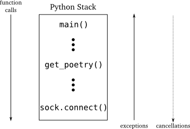

============================================
パート19: 欲しいと思っていても考えを改めると
============================================
..
    <h2 class="lwe-editable-pre">Part 19: I Thought I Wanted It But I Changed My Mind

はじめに
========
..
    <h3 class="lwe-editable-pre">Introduction

Twisted は現在進行形のプロジェクトですから、Twisted の開発者は日常的に新しい機能を追加したり、古い機能を拡張しています。
Twisted 10.1.0 のリリースでは、 ``Deferred`` クラスに新しい機能が追加されました。 `cancellation` です。
今日はこれについて掘り進めていきましょう。

..
    Twisted is an ongoing project and the Twisted developers regularly add new features and extend old ones. With the release of Twisted 10.1.0, the developers added a new capability — cancellation — to the ``Deferred`` class which we're going to investigate today.

非同期プログラミングはリクエストとレスポンスを分離し、新しい可能性をもたらします。
結果を要求することと、その結果を受け取ることの間に、それ以上は必要ないと決めるかもしれませんね。
":doc:`p14`" で作成した詩のプロキシサーバを考えてみましょう。
プロキシの動作は以下のようになります。少なくとも詩への最初のリクエストでは。

* 詩へのリクエストがやってきます。
* プロキシは詩を受け取るために実際のサーバに問い合わせます。
* 詩を受け取り終えると、元のクライアントに送ります。

..
    Asynchronous programming decouples requests from responses and thus raises a new possibility: between asking for the result and getting it back you might decide you don't want it anymore. Consider the poetry proxy server from ` <http://krondo.com/blog/?p=2205>Part 14`_. Here's how the proxy worked, at least for the first request of a poem:

    * A request for a poem comes in.
    * The proxy contacts the real server to get the poem.
    * Once the poem is complete, send it to the original client.

どれもがうまくいけば良いですが、詩を受け取る前にクライアントがハングしたらどうしましょうか？
`Paradise Lost <http://www.online-literature.com/milton/paradiselost/>`_ の完全なテキストを要求したものの、実は `Kojo <http://www.toyomasu.com/haiku/#kojo>`_ の俳句を欲しかったとしたらどうでしょう。
プロキシは最初の詩をダウンロードすることに固執し、ゆっくりしたサーバはしばらく時間をかけてきます。
接続を閉じてしまい、ゆっくりしたサーバにはスリープしてもらった方が良いかもしれませんね。

..
    Which is all well and good, but what if the client hangs up before getting the poem? Maybe they requested the complete text of ` <http://www.online-literature.com/milton/paradiselost/>Paradise Lost`_ and then decided they really wanted a haiku by ` <http://www.toyomasu.com/haiku/#kojo>Kojo`_. Now our proxy is stuck with downloading the first one and that slow server is going to take a while. Better to close the connection and let the slow server go back to sleep.

":ref:`figure15`"を思い出してください。同期プログラムでの概念的な制御フローを示すダイアグラムです。
あの図では、関数呼び出しが下に下っていき、例外は上に戻ってくることを確認しました。
同期する関数呼び出しをキャンセルしたいとき (これは単なる仮説です) は、  フロー制御は関数呼び出しと同じ方向に進んでいくでしょう。
図38の高レベルのコードから低レベルのコードに進んでいくようにです。

.. _figure38:

    図38：理論的なキャンセルもある、同期プログラムにおける情報の伝わり方

..
    Recall ` <http://krondo.com/?p=1825#figure15>Figure 15`_, a diagram that shows the conceptual flow of control in a synchronous program. In that figure we see function calls going down, and exceptions going back up. If we wanted to cancel a synchronous function call (and this is just hypothetical) the flow control would go in the same direction as the function call, from high-level code to low-level code as in Figure 38:
    
` <./part19_files/sync-cancel.png">`_
Figure 38: synchronous program flow, with hypothetical cancellation

もちろん同期プログラムでは、キャンセルすべき箇所がないために、高レベルのコードは低レベルの操作が終了するまで再開さえできませんから、そのようなことは不可能です。
しかし非同期プログラムでは、高レベルのコードは低レベルのコードが実行終了する前にプログラムの制御を獲得します。
少なくとも、低レベルのリクエストが終了する前に、それをキャンセルできる可能性があります。

..
    Of course, in a synchronous program that isn't possible because the high-level code doesn't even resume running until the low-level operation is finished, at which point there is nothing to cancel. But in an asynchronous program the high-level code gets control of the program before the low-level code is done, which at least raises the possibility of canceling the low-level request before it finishes.

Twisted プログラムでは、低レベルのリクエストは ``Deferred`` オブジェクトによってひつとにまとめられ、未解決の非同期操作に対する「ハンドル」("handle") として考えられます。
遅延オブジェクト内の情報の通常のフローは下方向に向かいます、低レベルのコードから高レベルのコードに移ることです。
これは、同期プログラムで情報が戻ってくるフローに合致します。
Twisted 10.1.0 からは、高レベルのコードは情報を送り返すことができるようになりました。
低レベルのコードに、結果はもういらない、と伝えられるのです。
図39を見てください。

.. _figure39:

.. figure:: images/p19_deferred-cancel.png

    図39：キャンセルも含んだ遅延オブジェクトにおける情報の伝わり方

..
    In a Twisted program, the lower-level request is embodied by a ``Deferred`` object, which you can think of as a "handle" on the outstanding asynchronous operation. The normal flow of information in a deferred is downward, from low-level code to high-level code, which matches the flow of return information in a synchronous program. Starting in Twisted 10.1.0, high-level code can send information back the other direction — it can tell the low-level code it doesn't want the result anymore. See Figure 39:
    
` <./part19_files/deferred-cancel.png">`_
Figure 39: Information flow in a deferred, including cancellation

遅延オブジェクトをキャンセルする
================================
..
    <h3 class="lwe-editable-pre">Canceling Deferreds

遅延オブジェクトをキャンセルすることが実際にどうやって動作するかを理解するために、いくつかのサンプルプログラムに目を通していきましょう。
なお、この例や、このパートの他のコードを実行させるためには `Twisted 10.1.0 かそれ以降のバージョン <http://twistedmatrix.com/trac/wiki/Downloads>`_ が必要です。
`deferred-cancel/defer-cancel-1.py <http://github.com/jdavisp3/twisted-intro/blob/master/deferred-cancel/defer-cancel-1.py#L1>`_ について考えてみましょう。
::

    from twisted.internet import defer

    def callback(res):
        print 'callback got:', res

    d = defer.Deferred()
    d.addCallback(callback)
    d.cancel()
    print 'done'

..
    Let's take a look at a few sample programs to see how canceling deferreds actually works. Note, to run the examples and other code in this Part you will need a ` <http://twistedmatrix.com/trac/wiki/Downloads>version`_ of Twisted 10.1.0 or later. Consider `deferred-cancel/defer-cancel-1.py <http://github.com/jdavisp3/twisted-intro/blob/master/deferred-cancel/defer-cancel-1.py#L1>`_:

    from twisted.internet import defer

    def callback(res):
        print 'callback got:', res

    d = defer.Deferred()
    d.addCallback(callback)
    d.cancel()
    print 'done'

新しいキャンセル機能により、 ``Deferred`` クラスには ``cancel`` という新しいメソッドが追加されました。
このコード例では、遅延オブジェクトを新しく生成し、コールバックを付け加えて、発火させずに遅延オブジェクトをキャンセルします。
次のような出力になります。 ::

    done
    Unhandled error in Deferred:
    Traceback (most recent call last):
    Failure: twisted.internet.defer.CancelledError:

..
    With the new cancellation feature, the ``Deferred`` class got a new method called ``cancel``. The example code makes a new deferred, adds a callback, and then cancels the deferred without firing it. Here's the output:

    done
    Unhandled error in Deferred:
    Traceback (most recent call last):
    Failure: twisted.internet.defer.CancelledError:

遅延オブジェクトをキャンセルすることは、エラー用コールバックのチェーンを実行させるかのようですね。
そして、通常のコールバックは決して呼び出されません。
そのエラーは ``twisted.internet.defer.CancelledError`` であることにも注意しましょう。
これは、遅延オブジェクトがキャンセルされたことを意味する独自の Exception です (もう少し先まで読んで！)。
`deferred-cancel/defer-cancel-2.py <http://github.com/jdavisp3/twisted-intro/blob/master/deferred-cancel/defer-cancel-2.py#L1>`_ でエラー用コールバックを追加してみましょう。
::

    from twisted.internet import defer

    def callback(res):
        print 'callback got:', res

    def errback(err):
        print 'errback got:', err

    d = defer.Deferred()
    d.addCallbacks(callback, errback)
    d.cancel()
    print 'done'

..
    Ok, so canceling a deferred appears to cause the errback chain to run, and our regular callback is never called at all. Also notice the error is a ``twisted.internet.defer.CancelledError``, a custom Exception that means the deferred was canceled (but keep reading!). Let's try adding an errback in `deferred-cancel/defer-cancel-2.py <http://github.com/jdavisp3/twisted-intro/blob/master/deferred-cancel/defer-cancel-2.py#L1>`_:

    from twisted.internet import defer

    def callback(res):
        print 'callback got:', res

    def errback(err):
        print 'errback got:', err

    d = defer.Deferred()
    d.addCallbacks(callback, errback)
    d.cancel()
    print 'done'

実行させてみると、このような出力になります。 ::

    errback got: [Failure instance: Traceback (failure with no frames): <class 'twisted.internet.defer.CancelledError'>:]
    done

..
    Now we get this output:

    errback got: [Failure instance: Traceback (failure with no frames): <class 'twisted.internet.defer.CancelledError'>:]
    done

つまり、他のどのような遅延オブジェクトの失敗とも同じように、キャンセルからのエラー用コールバックを 'catch' できます。
`deferred-cancel/defer-cancel-3.py <http://github.com/jdavisp3/twisted-intro/blob/master/deferred-cancel/defer-cancel-3.py#L1>`_ にあるように、遅延オブジェクトを発火させてから、キャンセルしてみましょう。
::

    from twisted.internet import defer

    def callback(res):
        print 'callback got:', res

    def errback(err):
        print 'errback got:', err

    d = defer.Deferred()
    d.addCallbacks(callback, errback)
    d.callback('result')
    d.cancel()
    print 'done'

..
    So we can 'catch' the errback from a cancel just like any other deferred failure.
    Ok, let's try firing the deferred and then canceling it, as in `deferred-cancel/defer-cancel-3.py <http://github.com/jdavisp3/twisted-intro/blob/master/deferred-cancel/defer-cancel-3.py#L1>`_:

    from twisted.internet import defer

    def callback(res):
        print 'callback got:', res

    def errback(err):
        print 'errback got:', err

    d = defer.Deferred()
    d.addCallbacks(callback, errback)
    d.callback('result')
    d.cancel()
    print 'done'

ここでは ``callback`` メソッドを使って普通に遅延オブジェクトを発火させ、キャンセルします。
出力です。 ::

    callback got: result
    done

..
    Here we fire the deferred normally with the ``callback`` method and then cancel it. Here's the output:

    callback got: result
    done

コールバックは呼び出され (予想通りですね)、プログラムは普通に終了しました。あたかも ``cancel`` は呼ばれなかったかのようですね。
ということで、遅延オブジェクトが発火済みだと、キャンセルすることは影響がないように見えます。(でも、もう少し先まで読んで！).

..
    Our callback was invoked (just as we would expect) and then the program finished normally, as if ``cancel`` was never called at all. So it seems canceling a deferred has no effect if it has already fired (but keep reading!).

`deferred-cancel/defer-cancel-4.py <http://github.com/jdavisp3/twisted-intro/blob/master/deferred-cancel/defer-cancel-4.py#L1>`_
にあるように、キャンセルした「後」に遅延オブジェクトを発火させるとどうでしょう？
::

    from twisted.internet import defer

    def callback(res):
        print 'callback got:', res

    def errback(err):
        print 'errback got:', err

    d = defer.Deferred()
    d.addCallbacks(callback, errback)
    d.cancel()
    d.callback('result')
    print 'done'

..
    What if we fire the deferred `after` we cancel it, as in `deferred-cancel/defer-cancel-4.py <http://github.com/jdavisp3/twisted-intro/blob/master/deferred-cancel/defer-cancel-4.py#L1>`_?

    from twisted.internet import defer

    def callback(res):
        print 'callback got:', res

    def errback(err):
        print 'errback got:', err

    d = defer.Deferred()
    d.addCallbacks(callback, errback)
    d.cancel()
    d.callback('result')
    print 'done'

そのような場合には、次の出力になります。 ::

    errback got: [Failure instance: Traceback (failure with no frames): <class 'twisted.internet.defer.CancelledError'>:]
    done

..
    In that case we get this output:

    errback got: [Failure instance: Traceback (failure with no frames): <class 'twisted.internet.defer.CancelledError'>:]
    done

おもしろいですね！
ふたつ目の例とまったく同じ出力です。遅延オブジェクトをまったく発火させていませんでしたね。
遅延オブジェクトがキャンセル済みだと、それを発火させても普通は何の影響もありません。
しかし、遅延オブジェクトを一回以上発火できるはずで、エラー用コールバックチェーンは明らかに動作しているのに、
どうして ``d.callback('result')`` はエラーを発生させなかったのでしょうか？

..
    Interesting! That's the same output as the second example, where we never fired the deferred at all. So if the deferred has been canceled, firing the deferred normally has no effect. But why doesn't ``d.callback('result')`` raise an error, since you're not supposed to be able to fire a deferred more than once, and the errback chain has clearly run?

もう一度":ref:`figure39`"について考えてみましょう。
正常な結果あるいは失敗を与えて遅延オブジェクトを発火させることは、低レベルコードの仕事です。
一方で、遅延オブジェクトのキャンセルは、高レベルコードによって実行されます。
遅延オブジェクトを発火させることは「これが結果ですよ」という意味です。
一方で、遅延オブジェクトをキャンセルすることは「これ以上は何もいらないよ」という意味です。
そして、キャンセルは新しい機能であることを思い出してください。
既存のほとんどの Twisted のコードは、キャンセル操作を処理するようには記述されていません。
しかし、Twisted の開発者たちはいかなる遅延オブジェクトもキャンセルできるようにしました。
たとえそのコードが Twisted 10.1.0 以前に書かれたものであっても。

..
    Consider Figure 39 again. Firing a deferred with a result or failure is the job of lower-level code, while canceling a deferred is an action taken by higher-level code. Firing the deferred means "Here's your result", while canceling a deferred means "I don't want it any more". And remember that canceling is a new feature, so most existing Twisted code is not written to handle cancel operations. But the Twisted developers have made it possible for us to cancel any deferred we want to, even if the code we got the deferred from was written before Twisted 10.1.0.

この実現において、 ``cancel`` メソッドは実際にはふたつのことを行います。

1. ``Deferred`` オブジェクト自身に、まだ発生していなければ (つまり、遅延オブジェクトが発火されていなければ) 結果はいらないと伝え、後続するいかなる ``callback`` や ``errback`` の呼び出しも無視します。
2. そして、その影響として、結果を生成している最中の低レベルのコードに、操作をキャンセルするために要求されるすべてのステップを踏むようにと伝えます。

..
    To make that possible, the ``cancel`` method actually does two things:

    * Tell the ``Deferred`` object `itself` that you don't want the result if it hasn't shown up yet (i.e, the deferred hasn't been fired), and thus to ignore any subsequent invocation of ``callback`` or ``errback``.
    * And, `optionally`, tell the lower-level code that is producing the result to take whatever steps are required to cancel the operation.

古い Twisted のコードは先へ先へと進み、キャンセルされた遅延オブジェクトも構わずに発火させますので、
ステップ１は、もしも古いライブラリから受け取った遅延オブジェクトをキャンセルしても、私たちのプログラムが台無しにならないことを保証してくれます。

..
    Since older Twisted code is going to go ahead and fire that canceled deferred anyway, step #1 ensures our program won't blow up if we cancel a deferred we got from an older library.

このことは、私たちはいつも遅延オブジェクトのキャンセルに気を払わなくとも良いことを意味します。
結果が届かなければ (たとえ後で届くとしても)、それはもう受け取らないと確信できます。
しかし、遅延オブジェクトのキャンセルは、実は非同期操作のキャンセルではないかもしれません。
非同期操作を中止するにはコンテキストに特有の処理を必要とします。
ネットワーク接続を閉じる必要があるかもしれませんし、データベースのトランザクションをロールバックする、あるいはサブプロセスを `kill` する、などなど。
また、遅延オブジェクトは汎用的なコールバックを構成するためのものですから、キャンセルするときに特定の処理を行うことを教えるにはどうしましょうか？
もしくはその代わりに、最初に遅延オブジェクトが生成されて返される低レベルのコードに、キャンセル要求を転送することはできるでしょうか？
今はこう言わせてください。

    知ってるさ、コールバックを使うんだ！

..
    This means we are always free to cancel a deferred, and we'll be sure not to get the result if it hasn't arrived (even if it arrives later). But canceling the deferred might not actually cancel the asynchronous operation. Aborting an asynchronous operation requires a context-specific action. You might need to close a network connection, roll back a database transaction, kill a sub-process, et cetera. And since a deferred is just a general-purpose callback organizer, how is it supposed to know what specific action to take when you cancel it? Or, alternatively, how could it forward the cancel request to the lower-level code that created and returned the deferred in the first place? Say it with me now:
    <blockquote class="lwe-editable-pre">I know, with a callback!

遅延オブジェクトをキャンセルする、本当に
========================================
..
    <h3 class="lwe-editable-pre">Canceling Deferreds, Really

それじゃあ `deferred-cancel/defer-cancel-5.py <http://github.com/jdavisp3/twisted-intro/blob/master/deferred-cancel/defer-cancel-5.py#L1>`_ を見ていきましょう。
::

    from twisted.internet import defer

    def canceller(d):
        print "I need to cancel this deferred:", d

    def callback(res):
        print 'callback got:', res

    def errback(err):
        print 'errback got:', err

    d = defer.Deferred(canceller) # created by lower-level code
    d.addCallbacks(callback, errback) # added by higher-level code
    d.cancel()
    print 'done'

..
    Alright, take a look at `deferred-cancel/defer-cancel-5.py <http://github.com/jdavisp3/twisted-intro/blob/master/deferred-cancel/defer-cancel-5.py#L1>`_:

    from twisted.internet import defer

    def canceller(d):
        print "I need to cancel this deferred:", d

    def callback(res):
        print 'callback got:', res

    def errback(err):
        print 'errback got:', err

    d = defer.Deferred(canceller) # created by lower-level code
    d.addCallbacks(callback, errback) # added by higher-level code
    d.cancel()
    print 'done'

このコードは基本的に二番目の例と同じです。
みっつ目のコールバック (``canceller``) があることを除けば。これは、後で追加されるのではなく、生成されたときに ``Deferred`` へ渡されます。
このコールバックは、非同期操作を停止させる (もちろん、遅延オブジェクトが実際にキャンセルされたときのみです) ために必要となるコンテキスト特有のアクションを実行することに責任を持ちます。
``canceller`` コールバックは必然的に遅延オブジェクトを返す低レベルのコードの一部です。
遅延オブジェクトを受け取って自分自身のコールバックとエラー用コールバックを追加するような高レベルのコードではありません。
サンプルコードを実行させて、次の出力を確認しましょう。 ::

    I need to cancel this deferred: <Deferred at 0xb7669d2cL>
    errback got: [Failure instance: Traceback (failure with no frames): <class 'twisted.internet.defer.CancelledError'>:]
    done

..
    This code is basically like the second example, except there is a third callback (``canceller``) that's passed to the ``Deferred`` when we create it, rather than added afterwards. This callback is in charge of performing the context-specific actions required to abort the asynchronous operation (only if the deferred is actually canceled, of course). The ``canceller`` callback is necessarily part of the lower-level code that returns the deferred, not the higher-level code that receives the deferred and adds its own callbacks and errbacks.
    Running the example produces this output:

    I need to cancel this deferred: <Deferred at 0xb7669d2cL>
    errback got: [Failure instance: Traceback (failure with no frames): <class 'twisted.internet.defer.CancelledError'>:]
    done

ご覧のように、 ``canceller`` コールバックは、もはや結果を必要としない遅延オブジェクトを与えられます。
この部分は、非同期操作を停止するために必要な、いかなるアクションも受け取れるところなのです。
``canceller`` は、エラー用コールバックのチェーンが発火するより前に呼び出されていることに注意しましょう。
実際この時点では、私たちが選択する何らかの結果あるいはエラーを与えて、私たち自身の遅延オブジェクトを発火するかもしれません
(それゆえ、 ``CancelledError`` の失敗を先取りします)。
どちらの可能性も `deferred-cancel/defer-cancel-6.py <http://github.com/jdavisp3/twisted-intro/blob/master/deferred-cancel/defer-cancel-6.py#L1>`_ と `deferred-cancel/defer-cancel-7.py <http://github.com/jdavisp3/twisted-intro/blob/master/deferred-cancel/defer-cancel-7.py#L1>`_ で説明されます。

..
    As you can see, the ``canceller`` callback is given the deferred whose result we no longer want. That's where we would take whatever action we need to in order to abort the asynchronous operation. Notice that ``canceller`` is invoked before the errback chain fires. In fact, we may choose to fire the deferred ourselves at this point with any result or error of our choice (and thus preempting the ``CancelledError`` failure). Both possibilities are illustrated in `deferred-cancel/defer-cancel-6.py <http://github.com/jdavisp3/twisted-intro/blob/master/deferred-cancel/defer-cancel-6.py#L1>`_ and `deferred-cancel/defer-cancel-7.py <http://github.com/jdavisp3/twisted-intro/blob/master/deferred-cancel/defer-cancel-7.py#L1>`_.

reactor を立ち上げる前に、もうひとつ簡単なテストをやってみましょう。
``canceller`` コールバックを持つ遅延オブジェクトを生成し、普通に発火させてからキャンセルします。
コードは `deferred-cancel/defer-cancel-8.py <http://github.com/jdavisp3/twisted-intro/blob/master/deferred-cancel/defer-cancel-8.py#L1>`_ にあります。
スクリプトの出力を検証することによって、遅延オブジェクトが発火された後にキャンセルすることは ``canceller`` コールバックを呼び出すことではない、と分かります。
キャンセルすべきものがありませんので、想定した通りです。

..
    Let's do one more simple test before we fire up the reactor. We'll create a deferred with a ``canceller`` callback, fire it normally, and then cancel it. You can see the code in `deferred-cancel/defer-cancel-8.py <http://github.com/jdavisp3/twisted-intro/blob/master/deferred-cancel/defer-cancel-8.py#L1>`_. By examining the output of that script, you can see that canceling a deferred after it has been fired does <em class="lwe-editable-pre">not</em> invoke the ``canceller`` callback. And that's as we would expect since there's nothing to cancel.

ここまで私たちが見てきた例は、実際のところ非同期操作ではありませんでした。
非同期操作を呼び出す簡単なプログラムを作成しましょう。操作をキャンセル可能にする方法が分かるはずです。
`deferred-cancel/defer-cancel-9.py <http://github.com/jdavisp3/twisted-intro/blob/master/deferred-cancel/defer-cancel-9.py#L1>`_ のコードについて考えます。
::

    from twisted.internet.defer import Deferred

    def send_poem(d):
        print 'Sending poem'
        d.callback('Once upon a midnight dreary')

    def get_poem():
        """Return a poem 5 seconds later."""
        from twisted.internet import reactor
        d = Deferred()
        reactor.callLater(5, send_poem, d)
        return d

    def got_poem(poem):
        print 'I got a poem:', poem

    def poem_error(err):
        print 'get_poem failed:', err

    def main():
        from twisted.internet import reactor
        reactor.callLater(10, reactor.stop) # stop the reactor in 10 seconds

        d = get_poem()
        d.addCallbacks(got_poem, poem_error)

        reactor.run()

    main()

..
    The examples we've looked at so far haven't had any actual asynchronous operations. Let's make a simple program that invokes one asynchronous operation, then we'll figure out how to make that operation cancellable. Consider the code in `deferred-cancel/defer-cancel-9.py <http://github.com/jdavisp3/twisted-intro/blob/master/deferred-cancel/defer-cancel-9.py#L1>`_:

    from twisted.internet.defer import Deferred

    def send_poem(d):
        print 'Sending poem'
        d.callback('Once upon a midnight dreary')

    def get_poem():
        """Return a poem 5 seconds later."""
        from twisted.internet import reactor
        d = Deferred()
        reactor.callLater(5, send_poem, d)
        return d

    def got_poem(poem):
        print 'I got a poem:', poem

    def poem_error(err):
        print 'get_poem failed:', err

    def main():
        from twisted.internet import reactor
        reactor.callLater(10, reactor.stop) # stop the reactor in 10 seconds

        d = get_poem()
        d.addCallbacks(got_poem, poem_error)

        reactor.run()

    main()

この例には、 ``get_poem`` が呼び出されてから５秒後に非同期に詩を返すために reactor の ``callLater`` メソッドを使う、 ``get_poem`` (``send_poem`` の間違い？) 関数があります。
``main`` 関数は ``get_poem`` を呼び出し、コールバックとエラー用コールバックのペアを追加します。それから reactor を開始させます。
10秒で reactor を停止させるための設定もしておきます (もう一度 ``callLater`` を使って)。
普通に遅延オブジェクトにコールバックを割り当てることによってこれを実装しますが、なんでこうするかを簡潔に確認しておきましょう。

..
    This example includes a ``get_poem`` function that uses the reactor's ``callLater`` method to asynchronously return a poem five seconds after ``get_poem`` is called. The ``main`` function calls ``get_poem``, adds a callback/errback pair, and then starts up the reactor. We also arrange (again using ``callLater``) to stop the reactor in ten seconds. Normally we would do this by attaching a callback to the deferred, but you'll see why we do it this way shortly.

コード例を実行させると、次の出力になります (適切な待ち時間の後で)。 ::

    Sending poem
    I got a poem: Once upon a midnight dreary

..
    Running the example produces this output (after the appropriate delay):

    Sending poem
    I got a poem: Once upon a midnight dreary

そして10秒後にプログラムは停止します。
詩を送信される前に、この遅延オブジェクトをキャンセルしてみましょう。
10秒後に遅延オブジェクトをキャンセルするために、ちょっとしたコードを追加します (詩自体が5秒遅れる前です)。 ::

    reactor.callLater(2, d.cancel) # cancel after 2 seconds

..
    And after ten seconds our little program comes to a stop. Now let's try canceling that deferred before the poem is sent. We'll just add this bit of code to cancel the deferred after two seconds (well before the five second delay on the poem itself):

        reactor.callLater(2, d.cancel) # cancel after 2 seconds

プログラムの全体は `deferred-cancel/defer-cancel-10.py <http://github.com/jdavisp3/twisted-intro/blob/master/deferred-cancel/defer-cancel-10.py#L1>`_ にあります。
この出力は以下のようになります。 ::

    get_poem failed: [Failure instance: Traceback (failure with no frames): <class 'twisted.internet.defer.CancelledError'>:]
    Sending poem

..
    The complete program is in `deferred-cancel/defer-cancel-10.py <http://github.com/jdavisp3/twisted-intro/blob/master/deferred-cancel/defer-cancel-10.py#L1>`_, which produces the following output:

    get_poem failed: [Failure instance: Traceback (failure with no frames): <class 'twisted.internet.defer.CancelledError'>:]
    Sending poem

この例ははっきりと、遅延オブジェクトをキャンセルすることは、必ずしもその根底にある非同期リクエストをキャンセルしない、ということを描写しています。
2秒後にエラー用コールバックからの出力がありますね。期待した通りに ``CancelledError`` を表示します。
しかしそれでも、5秒後に ``send_poem`` からの出力が見えます (けれども、遅延オブジェクトのコールバックは発火しません)。

..
    This example clearly illustrates that canceling a deferred does not necessarily cancel the underlying asynchronous request. After two seconds we see the output from our errback, printing out the ``CancelledError`` as we would expect. But then after five seconds will still see the output from ``send_poem`` (but the callback on the deferred doesn't fire).

この時点では、 `deferred-cancel/defer-cancel-4.py <http://github.com/jdavisp3/twisted-intro/blob/master/deferred-cancel/defer-cancel-4.py#L1>`_ にあるのと同じ状況になっただけです。
遅延オブジェクトを「キャンセルする」ことは、結局は結果がキャンセルされるようになりますが、本当のところで操作を停止はしないのです。
ここまでで学んだように、本当にキャンセル可能な遅延オブジェクトを作成するためには、遅延オブジェクトが生成されたときに ``cancel`` コールバックを追加しなければなりません。

..
    At this point we're just in the same situation as `deferred-cancel/defer-cancel-4.py <http://github.com/jdavisp3/twisted-intro/blob/master/deferred-cancel/defer-cancel-4.py#L1>`_. "Canceling" the deferred causes the eventual result to be ignored, but doesn't abort the operation in any real sense. As we learned above, to make a truly cancelable deferred we must add a ``cancel`` callback when the deferred is created.

この新しいコールバックは何をする必要があるのでしょうか？
``callLater`` メソッドの `ドキュメント <http://twistedmatrix.com/trac/browser/tags/releases/twisted-10.1.0/twisted/internet/interfaces.py#L556>`_ に目を通しましょう。
``callLater`` の戻り値は異なるオブジェクトで、 ``IDelayedCall`` を実装しており、実行されている部分から遅らされた呼び出しを防止するために使える ``cancel`` メソッドを持ちます。

..
    What does this new callback need to do? Take a look at the `documentation <http://twistedmatrix.com/trac/browser/tags/releases/twisted-10.1.0/twisted/internet/interfaces.py#L556>`_ for the ``callLater`` method. The return value of ``callLater`` is another object, implementing ``IDelayedCall``, with a ``cancel`` method we can use to prevent the delayed call from being executed.

これはとてもシンプルですね。
修正したコードは `deferred-cancel/defer-cancel-11.py <http://github.com/jdavisp3/twisted-intro/blob/master/deferred-cancel/defer-cancel-11.py#L1>`_ にあります。
関連のある変更点はすべて ``get_poem`` 関数にあります。
::

    def get_poem():
        """Return a poem 5 seconds later."""

        def canceler(d):
            # They don't want the poem anymore, so cancel the delayed call
            delayed_call.cancel()

            # At this point we have three choices:
            #   1. Do nothing, and the deferred will fire the errback
            #      chain with CancelledError.
            #   2. Fire the errback chain with a different error.
            #   3. Fire the callback chain with an alternative result.

        d = Deferred(canceler)

        from twisted.internet import reactor
        delayed_call = reactor.callLater(5, send_poem, d)

        return d

..
    That's pretty simple, and the updated code is in `deferred-cancel/defer-cancel-11.py <http://github.com/jdavisp3/twisted-intro/blob/master/deferred-cancel/defer-cancel-11.py#L1>`_. The relevant changes are all in the ``get_poem`` function:
    
    def get_poem():
        """Return a poem 5 seconds later."""

        def canceler(d):
            # They don't want the poem anymore, so cancel the delayed call
            delayed_call.cancel()

            # At this point we have three choices:
            #   1. Do nothing, and the deferred will fire the errback
            #      chain with CancelledError.
            #   2. Fire the errback chain with a different error.
            #   3. Fire the callback chain with an alternative result.

        d = Deferred(canceler)

        from twisted.internet import reactor
        delayed_call = reactor.callLater(5, send_poem, d)

        return d

新しいバージョンでは、キャンセルコールバックで利用できるように、 ``callLater`` からの戻り値を保存します。
コールバックは ``delayed_call.cancel()`` を呼び出すだけです。
しかし、上述の議論のように、遅延オブジェクト自身を発火させることも選べるでしょう。
最新バージョンの例ではこのような出力になります。 ::

    get_poem failed: [Failure instance: Traceback (failure with no frames): <class 'twisted.internet.defer.CancelledError'>:]

..
    In this new version, we save the return value from ``callLater`` so we can use it in our cancel callback. The only thing our callback needs to do is invoke ``delayed_call.cancel()``. But as we discussed above, we could also choose to fire the deferred ourselves. The latest version of our example produces this output:

    get_poem failed: [Failure instance: Traceback (failure with no frames): <class 'twisted.internet.defer.CancelledError'>:]

お分かりのように、遅延オブジェクトはキャンセルされ、非同期操作は真の意味で中止されました (つまり ``send_poem`` の ``print`` 出力を見ることはありません)。

..
    As you can see, the deferred is canceled and the asynchronous operation has truly been aborted (i.e., we don't see the ``print`` output from ``send_poem``).

詩のプロキシ 3.0
================
..
    <h3 class="lwe-editable-pre">Poetry Proxy 3.0

導入部分で議論したように、詩のプロキシサーバーはキャンセル処理を実装するには格好の例です。
誰も要求していないことが分かったら、詩のダウンロードを中止できるようにしましょう (つまり、クライアントは詩を送る前に接続を閉じます)。
プロキシのバージョン 3.0 は、 `twisted-server-4/poetry-proxy.py <http://github.com/jdavisp3/twisted-intro/blob/master/twisted-server-4/poetry-proxy.py#L1>`_ にありますが、遅延オブジェクトのキャンセルを実装しています。
最初の変更点は `PoetryProxyProtocol <http://github.com/jdavisp3/twisted-intro/blob/master/twisted-server-4/poetry-proxy.py#L52>`_ にあります。
::

    class PoetryProxyProtocol(Protocol):

        def connectionMade(self):
            self.deferred = self.factory.service.get_poem()
            self.deferred.addCallback(self.transport.write)
            self.deferred.addBoth(lambda r: self.transport.loseConnection())

        def connectionLost(self, reason):
            if self.deferred is not None:
                deferred, self.deferred = self.deferred, None
                deferred.cancel() # cancel the deferred if it hasn't fired

..
    As we discussed in the Introduction, the poetry proxy server is a good candidate for implementing cancellation, as it allows us to abort the poem download if it turns out that nobody wants it (i.e., the client closes the connection before we send the poem). Version 3.0 of the proxy, located in `twisted-server-4/poetry-proxy.py <http://github.com/jdavisp3/twisted-intro/blob/master/twisted-server-4/poetry-proxy.py#L1>`_, implements deferred cancellation. The first change is in the `PoetryProxyProtocol <http://github.com/jdavisp3/twisted-intro/blob/master/twisted-server-4/poetry-proxy.py#L52>`_:

    class PoetryProxyProtocol(Protocol):

        def connectionMade(self):
            self.deferred = self.factory.service.get_poem()
            self.deferred.addCallback(self.transport.write)
            self.deferred.addBoth(lambda r: self.transport.loseConnection())

        def connectionLost(self, reason):
            if self.deferred is not None:
                deferred, self.deferred = self.deferred, None
                deferred.cancel() # cancel the deferred if it hasn't fired

`古いバージョンの PoetryProxyProtocol <http://github.com/jdavisp3/twisted-intro/blob/master/twisted-server-2/poetry-proxy.py#L52>`_ と比較してみます。
ふたつの大きな変更点があります。

1. 必要になったら後でキャンセルできるように、 ``get_poem`` から受け取った遅延オブジェクトを保存します。
2. 接続が閉じられたときに遅延オブジェクトをキャンセルします。
   これは実際に詩を受け取った後に遅延オブジェクトもキャンセルすることに注意しましょう。
   しかし、この例で分かったように、発火済みの遅延オブジェクトをキャンセルすることは何の影響も与えません。

..
    You might compare it to the `older version <http://github.com/jdavisp3/twisted-intro/blob/master/twisted-server-2/poetry-proxy.py#L52>`_. The two main changes are:

    * Save the deferred we get from ``get_poem`` so we can cancel later if we need to.
    * Cancel the deferred when the connection is closed. Note this also cancels the deferred after we actually get the poem, but as we discovered in the examples, canceling a deferred that has already fired has no effect.

今度は、遅延オブジェクトのキャンセルが本当に詩のダウンロードを中止しているかをはっきりさせる必要があります。
これには `ProxyService <http://github.com/jdavisp3/twisted-intro/blob/master/twisted-server-4/poetry-proxy.py#L105>`_ を変更します。
::

    class ProxyService(object):

        poem = None # the cached poem

        def __init__(self, host, port):
            self.host = host
            self.port = port

        def get_poem(self):
            if self.poem is not None:
                print 'Using cached poem.'
                # return an already-fired deferred
                return succeed(self.poem)

            def canceler(d):
                print 'Canceling poem download.'
                factory.deferred = None
                connector.disconnect()

            print 'Fetching poem from server.'
            deferred = Deferred(canceler)
            deferred.addCallback(self.set_poem)
            factory = PoetryClientFactory(deferred)
            from twisted.internet import reactor
            connector = reactor.connectTCP(self.host, self.port, factory)
            return factory.deferred

        def set_poem(self, poem):
            self.poem = poem
            return poem

..
    Now we need to make sure that canceling the deferred actually aborts the poem download. For that we need to change the `ProxyService <http://github.com/jdavisp3/twisted-intro/blob/master/twisted-server-4/poetry-proxy.py#L105>`_:

    class ProxyService(object):

        poem = None # the cached poem

        def __init__(self, host, port):
            self.host = host
            self.port = port

        def get_poem(self):
            if self.poem is not None:
                print 'Using cached poem.'
                # return an already-fired deferred
                return succeed(self.poem)

            def canceler(d):
                print 'Canceling poem download.'
                factory.deferred = None
                connector.disconnect()

            print 'Fetching poem from server.'
            deferred = Deferred(canceler)
            deferred.addCallback(self.set_poem)
            factory = PoetryClientFactory(deferred)
            from twisted.internet import reactor
            connector = reactor.connectTCP(self.host, self.port, factory)
            return factory.deferred

        def set_poem(self, poem):
            self.poem = poem
            return poem

もう一度 `古いバージョンの PoetryService <http://github.com/jdavisp3/twisted-intro/blob/master/twisted-server-2/poetry-proxy.py#100>`_ と比較してみましょう。
このクラスにはさらにいくつかの変更点があります。

1. ``reactor.connectTCP`` の戻り値を保存します。
   保存したデータは `IConnector <http://twistedmatrix.com/trac/browser/tags/releases/twisted-10.1.0/twisted/internet/interfaces.py#L24>`_ オブジェクトです。
   接続を閉じるためにこのオブジェクトの ``disconnect`` メソッドを使えます。
2. ``canceler`` コールバックを持った遅延オブジェクトを作成します。
   このコールバックは、接続を閉じるために ``connector`` を使うクロージャーです。
   しかしまずは、 ``factory.deferred`` 属性に ``None`` を設定します。
   さもなければ、遅延オブジェクト自身が ``CancelledError`` を伴って発火する前に、ファクトリは "connection closed" というエラー用コールバックを渡して遅延オブジェクトを発火させるかもしれません。
   この遅延オブジェクトはキャンセルされましたので、 ``CancelledError`` と一緒に遅延オブジェクトを発火させることがより明示的になります。

..
    Again, you may wish to compare this with the `older version <http://github.com/jdavisp3/twisted-intro/blob/master/twisted-server-2/poetry-proxy.py#100>`_. This class has a few more changes:

    * We save the return value from ``reactor.connectTCP``, an `IConnector <http://twistedmatrix.com/trac/browser/tags/releases/twisted-10.1.0/twisted/internet/interfaces.py#L24>`_ object. We can use the ``disconnect`` method on that object to close the connection.
    * We create the deferred with a ``canceler`` callback. That callback is a closure which uses the ``connector`` to close the connection. But first it sets the ``factory.deferred`` attribute to ``None``. Otherwise, the factory might fire the deferred with a "connection closed" errback before the deferred itself fires with a ``CancelledError``. Since this deferred was canceled, having the deferred fire with ``CancelledError`` seems more explicit.

今回は ``PoetryClientFactory`` ではなく ``ProxyService`` で遅延オブジェクトを生成していることに気付いたでしょうか。
キャンセラーコールバックは ``IConnector`` オブジェクトにアクセスする必要がありますので、遅延オブジェクトを生成するには ``ProxyService`` がもっとも便利な場所だ、といえます。

..
    You might also notice we now create the deferred in the ``ProxyService`` instead of the ``PoetryClientFactory``. Since the canceler callback needs to access the ``IConnector`` object, the ``ProxyService`` ends up being the most convenient place to create the deferred.

そしてここまでの例のひとつにあるように、 ``canceler`` コールバックはクロージャーとして実装されています。
キャンセルコールバックを実装するときにクロージャーはとても便利にみえますね！

..
    And, as in one of our earlier examples, our ``canceler`` callback is implemented as a closure. Closures seem to be very useful when implementing cancel callbacks!

それでは、新しいプロキシを試してみましょう。
まずは `slow` サーバを起動します。
ゆっくり動きますから、キャンセルするための時間は十分にあります。 ::

    python blocking-server/slowpoetry.py --port 10001 poetry/fascination.txt

..
    Let's try out our new proxy. First start up a `slow` server. It needs to be slow so we actually have time to cancel:

    python blocking-server/slowpoetry.py --port 10001 poetry/fascination.txt

プロキシを立ち上げましょう。 (Twisted 10.1.0 が必要であることを忘れないでくださいね) ::

    python twisted-server-4/poetry-proxy.py --port 10000 10001

..
    Now we can start up our proxy (remember you need Twisted 10.1.0):

    python twisted-server-4/poetry-proxy.py --port 10000 10001

なんらかのクライアント、もしくは単に ``curl`` コマンドを使って、プロキシから詩をダウンロードし始めましょう。 ::

    curl localhost:10000

..
    Now we can start downloading a poem from the proxy using any client, or even just ``curl``:

    curl localhost:10000

2, 3 秒後に, クライアントか ``curl`` プロセス を停止させるために ``Ctrl-C`` を押してください。
プロキシを実行しているターミナルで、この様な出力を確認できますね。 ::

    Fetching poem from server.
    Canceling poem download.

..
    After a few seconds, press ``Ctrl-C`` to stop the client, or the ``curl`` process. In the terminal running the proxy you should
    see this output:

    Fetching poem from server.
    Canceling poem download.

プロキシがハングアップするため、 `slow` サーバは送信するそれぞれの詩に対する出力の表示を止めた、とみるべきでしょう。
クライアントを何回も開始と終了させて、その度にダウンロードがキャンセルされることを検証しましょう。
しかし、詩を完全にダウンロードさせてしまえば、プロキシはその詩をキャッシュして、それ以降は即座に送り返します。

..
    And you should see the slow server has stopped printing output for each bit of poem it sends, since our proxy hung up. You can start and stop the client multiple times to verify each download is canceled each time. But if you let the poem run to completion, then the proxy caches the poem and sends it immediately after that.

驚くべきことをもうひとつ
========================
..
    <h3 class="lwe-editable-pre">One More Wrinkle

ここまでで、発火済みの遅延オブジェクトをキャンセルしても何の影響もない、と何度か述べてきました。
ですが、これは実際には正しくありません。
":doc:`p13`"で、遅延オブジェクトに追加されたコールバックとエラー用コールバックは遅延オブジェクト自身を返すかもしれない、と学びました。
この場合は、元の (外側の) 遅延オブジェクトはコールバックチェーンの処理を停止し、内側の遅延オブジェクトが発火するのを待ちます (":ref:`figure28`"を見てください)。

..
    We said several times above that canceling an already-fired deferred has no effect. Well, that's not quite true. In ` <http://krondo.com/blog/?p=2159>Part 13`_ we learned that the callbacks and errbacks attached to a deferred may return deferreds themselves. And in that case, the original (outer) deferred pauses the execution of its callback chains and waits for the inner deferred to fire (see ` <http://krondo.com/blog/?p=2159#figure28>Figure 28`_).

したがって、コールバックチェーンは内側の遅延オブジェクトが終わるのを待った状態で停止させられますから、遅延オブジェクトが高レベルのコードを発火させたにも関わらず、作成した非同期リクエストは結果をまだ受け取っていないかもしれません。
そこで、高レベルのコードがその外側の遅延オブジェクトをキャンセルしたら何が起きるでしょうか？
この場合は、外側の遅延オブジェクトは自分自身をキャンセルしません (結局、発火済みですから)。
その代わりに、外側の遅延オブジェクトは内側の遅延オブジェクトをキャンセルします。

..
    Thus, even though a deferred has fired the higher-level code that made the asynchronous request may not have received the result yet, because the callback chain is paused waiting for an inner deferred to finish. So what happens if the higher-level code cancels that outer deferred? In that case the outer deferred does not cancel itself (it has already fired after all); instead, the outer deferred cancels the inner deferred.

遅延オブジェクトをキャンセルするときに、メインの非同期操作をキャンセルしていないかもしれません。
それよりむしろ、一番最初の結果として他の何らかの非同期操作を引き起こしたかもしれません。
ヒュー！

..
    So when you cancel a deferred, you might not be canceling the main asynchronous operation, but rather some other asynchronous operation triggered as a result of the first. Whew!

もうひとつの例でこれを具体化しましょう。
`deferred-cancel/defer-cancel-12.py <http://github.com/jdavisp3/twisted-intro/blob/master/deferred-cancel/defer-cancel-12.py#L1>`_ にあるコードについて考えます。
::

    from twisted.internet import defer

    def cancel_outer(d):
        print "outer cancel callback."

    def cancel_inner(d):
        print "inner cancel callback."

    def first_outer_callback(res):
        print 'first outer callback, returning inner deferred'
        return inner_d

    def second_outer_callback(res):
        print 'second outer callback got:', res

    def outer_errback(err):
        print 'outer errback got:', err

    outer_d = defer.Deferred(cancel_outer)
    inner_d = defer.Deferred(cancel_inner)

    outer_d.addCallback(first_outer_callback)
    outer_d.addCallbacks(second_outer_callback, outer_errback)

    outer_d.callback('result')

    # at this point the outer deferred has fired, but is paused
    # on the inner deferred.

    print 'canceling outer deferred.'
    outer_d.cancel()

    print 'done'

..
    We can illustrate this with one more example. Consider the code in `deferred-cancel/defer-cancel-12.py <http://github.com/jdavisp3/twisted-intro/blob/master/deferred-cancel/defer-cancel-12.py#L1>`_:

    from twisted.internet import defer

    def cancel_outer(d):
        print "outer cancel callback."

    def cancel_inner(d):
        print "inner cancel callback."

    def first_outer_callback(res):
        print 'first outer callback, returning inner deferred'
        return inner_d

    def second_outer_callback(res):
        print 'second outer callback got:', res

    def outer_errback(err):
        print 'outer errback got:', err

    outer_d = defer.Deferred(cancel_outer)
    inner_d = defer.Deferred(cancel_inner)

    outer_d.addCallback(first_outer_callback)
    outer_d.addCallbacks(second_outer_callback, outer_errback)

    outer_d.callback('result')

    # at this point the outer deferred has fired, but is paused
    # on the inner deferred.

    print 'canceling outer deferred.'
    outer_d.cancel()

    print 'done'

この例ではふたつの遅延オブジェクト、 ``outer_d`` と ``inner_d`` 、を生成し、外側のコールバックのひとつは ``inner_d`` を返します。
最初に ``outer_d`` を発火させ、すぐにキャンセルします。
このサンプルコードの出力は次のようになります。 ::

    first outer callback, returning inner deferred
    canceling outer deferred.
    inner cancel callback.
    outer errback got: [Failure instance: Traceback (failure with no frames): <class 'twisted.internet.defer.CancelledError'>:]
    done

..
    In this example we create two deferreds, the outer and the inner, and have one of the outer callbacks return the inner deferred. First we fire the outer deferred, and then we cancel it. The example produces this output:

    first outer callback, returning inner deferred
    canceling outer deferred.
    inner cancel callback.
    outer errback got: [Failure instance: Traceback (failure with no frames): <class 'twisted.internet.defer.CancelledError'>:]
    done

お分かりのように、外側の遅延オブジェクトをキャンセルしても、外側の遅延オブジェクトのキャンセルコールバックを発火させることにはつながりません。
そうではなく、内側の遅延オブジェクトのキャンセルコールバックを発火させますので、外側のエラー用コールバックは ``CancelledError`` を受け取ります (内側の遅延オブジェクトから)。

..
    As you can see, canceling the outer deferred does not cause the outer cancel callback to fire. Instead, it cancels the inner deferred so the inner cancel callback fires, and then outer errback receives the ``CancelledError`` (from the inner deferred).

しばらくはこのコードを眺めて、いくつかの異なることが結果にどのような影響を与えるかを実験してみてください。

..
    You may wish to stare at that code a while, and try out variations to see how they affect the outcome.

議論
====
..
    <h3 class="lwe-editable-pre">Discussion

遅延オブジェクトのキャンセルは、必要なくなった処理を回避できますので、非常に便利な操作になりえます。
一方でここまでで見てきたように、少しトリッキーともいえます。

..
    Canceling a deferred can be a very useful operation, allowing our programs to avoid work they no longer need to do. And as we have seen, it can be a little bit tricky, too.

心に留めておくべき重要なこととして、遅延オブジェクトをキャンセルしても必ずしも低レベルの非同期操作もキャンセルするわけではない、ということが挙げられます。
実際、この記事を書いている時点では、ほとんどの遅延オブジェクトが実際には "cancel" しません。
たいていの Twisted のコードは Twisted 10.1.0 より以前に記述されており、まだ更新が追いついていないからです。
Twisted 自体のたくさんの API も含まれいますよ！
遅延オブジェクトのキャンセルが本当にリクエストをキャンセルするか、それとも単に無視するのかを判別するために、ドキュメントとソースコードを確認してください。

..
    One very important fact to keep in mind is that canceling a deferred doesn't necessarily cancel the underlying asynchronous operation. In fact, as of this writing, most deferreds won't really "cancel", since most Twisted code was written prior to Twisted 10.1.0 and hasn't been updated. This includes many of the APIs in Twisted itself! Check the documentation and/or the source code to find out whether canceling the deferred will truly cancel the request, or simply ignore it.

重要なことの二つ目は、非同期 API から単純に遅延オブジェクトを返しても、文字通り完全にはキャンセル可能にはならない、ということです。
自分自身のプログラムでキャンセル処理を実装したいときは、さらなる例を求めて Twisted のソースコードを学ぶべきです。
キャンセル処理はまったく新しい機能ですから、パターンやベストプラクティスは今なお追及されています。

..
    And the second important fact is that simply returning a deferred from your asynchronous APIs will not necessarily make them cancelable in the complete sense of the word. If you want to implement canceling in your own programs, you should study the Twisted source code to find more examples. Cancellation is a brand new feature so the patterns and best practices are still being worked out.

次は
====
..
    <h3 class="lwe-editable-pre">Looking Ahead

これで `Deferreds` に関するすべてのことと、Twisted の背後にある主要なコンセプトを学びました。
つまり、紹介すべきことはこれ以上にそうそうありません。
Twisted の残りの部分は、Web プログラミングや非同期なデータベース接続のような、特定のアプリケーションを構築するためのものです。
ということで次の":doc:`p20`"では、ちょっと回り道をして、非同期 I/O を使う他のふたつのシステムにも目を向けてみましょう。
Twisted における考え方と、それらの考え方にどのような関係があるのでしょう。
それが終わったら最後のパートで今までのまとめをして、Twisted の学習を続けるに当たってのお勧めの方法を考えましょう。

..
    At this point we've learned just about everything about Deferreds and the core concepts behind Twisted. Which means there's not much more to introduce, as the rest of Twisted consists mainly of specific applications, like web programming or asynchronous database access. So in the ` <http://krondo.com/blog/?p=2692>next`_ couple of Parts we're going to take a little detour and look at two other systems that use asynchronous I/O to see how some of their ideas relate to the ideas in Twisted. Then, in the final Part, we will wrap up and suggest ways to continue your Twisted education.

おすすめの練習問題
------------------
..
    <h3 class="lwe-editable-pre">Suggested Exercises

* "canceled" の綴りがふたつ以上あることをご存知でしたか？
  `本当です <http://mw4.m-w.com/dictionary/canceled>`_ 。
  あなたの気分次第なのです。
* キャンセルの実装に格別の注意を払いながら、 `Deferred <http://twistedmatrix.com/trac/browser/tags/releases/twisted-10.1.0/twisted/internet/defer.py#L167>`_ クラスのソースコードを熟読しましょう。
* コールバックをキャンセルする遅延オブジェクトの例を Twisted 10.10 の `ソースコード
  <http://twistedmatrix.com/trac/browser/tags/releases/twisted-10.1.0/>`_ から探し、
  実装を学んでください。
* 詩のクライアントのひとつの ``get_poetry`` メソッドの戻り値である遅延オブジェクトを、キャンセルできるようにしてください。
* reactor ベースのコード例を、内側の遅延オブジェクトで停止された外側の遅延オブジェクトをキャンセルするようにしてください。
  ``callLater`` を使うと、外側の遅延オブジェクトが即座にキャンセルされること保証するために、注意深く `delays` を選択する必要があります。
* Twisted の中で、本当のキャンセルをサポートしていない非同期 API を見つけて、それにキャンセルを実装してください。
  できたら Twisted プロジェクトに `パッチを送ってください <http://twistedmatrix.com/trac/wiki/BasicGuideToContributingCode>`_ 。
  ユニットテストも忘れずに！

..
    * Did you know you can spell canceled with one or two els? `It's true <http://mw4.m-w.com/dictionary/canceled>`_. It all depends on what sort of mood you're in.
    * Peruse the source code of the `Deferred <http://twistedmatrix.com/trac/browser/tags/releases/twisted-10.1.0/twisted/internet/defer.py#L167>`_ class, paying special attention to the implementation of cancellation.
    * Search the Twisted 10.10 `source code <http://twistedmatrix.com/trac/browser/tags/releases/twisted-10.1.0/>`_ for examples of deferreds with cancel callbacks. Study their implementation.
    * Make the deferred returned by the ``get_poetry`` method of one of our poetry clients cancelable.
    * Make a reactor-based example that illustrates canceling an outer deferred which is paused on an inner deferred. If you use ``callLater`` you will need to choose the delays carefully to ensure the outer deferred is canceled at the right moment.
    * Find an asynchronous API in Twisted that doesn't support a true cancel and implement cancellation for it. `Submit a patch <http://twistedmatrix.com/trac/wiki/BasicGuideToContributingCode>`_ to the Twisted project. Don't forget unit tests!
